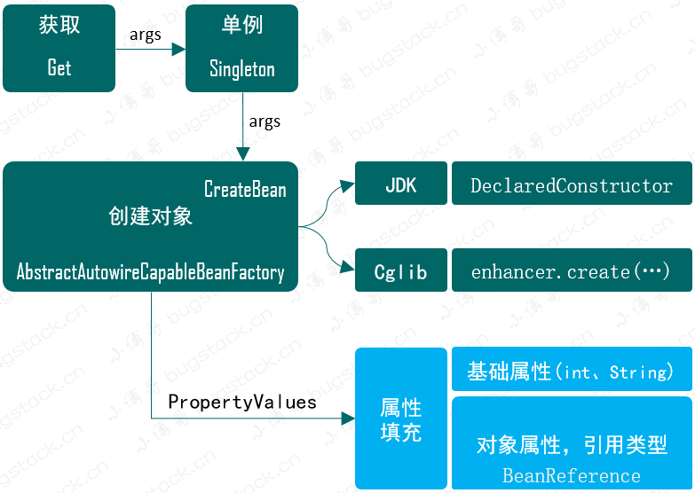
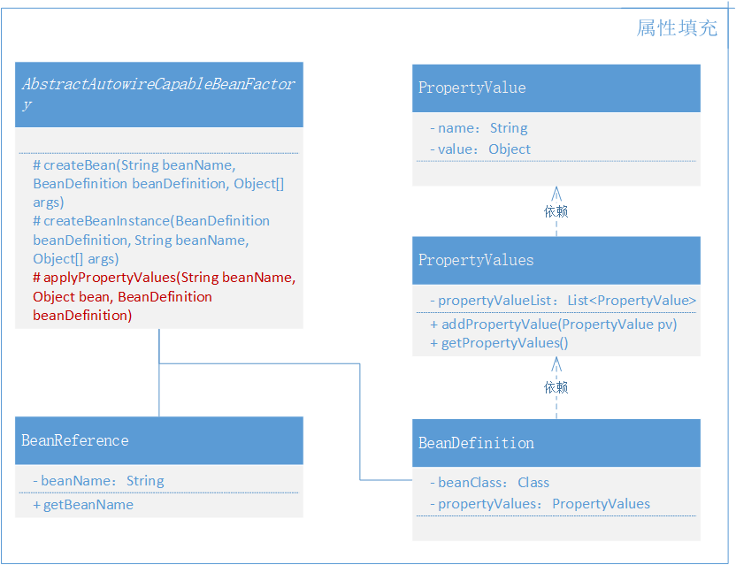

### 第四章：注入属性和依赖对象

`学习重点`

通过模版模式细分拆解Bean对象的实例化过程，在第3章创建Bean对象的基础上，将PropertyValues引入BeanDefinition定义中，在对象实例化完成后，填充Bean对象的属性。

`学习收获`

1. 在前面章节的学习中，我们介绍了

   （1）实现容器、定义和注册Bean对象

   （2）将Bean对象实例化 --- 单例模式

   （3）按照是否包含带入参的构造函数实现不同的实例化策略 --- 策略模式

   （4）那么接下来我们考虑的就是类中属性的问题

2. 关于类的细分拆解我们提到了模版模式，那么接下来简单介绍一下模版模式：

   模版模式指定义一个操作中的算法骨架，而将算法的一些步骤延迟到子类中，使得子类可以不改变该算法结构的情况下重定义该算法的某些特定步骤。（也是与其名字非常符合，简单来说就是定义一个模版让子类具体实现）

3. 在本章节我们需要增加3个类，BeanReference（类引用）、PropertyValue（属性值）、PropertyValues（属性集合）。因为属性可以是基本数据类型，也可以是引用数据类型。以及在AbstractAutowireCapableBeanFactory类的createBean方法中添加applyPropertyValues方法。

4. 这里需要注意的是，当遇见引用数据类型，我们的处理方式是递归获取Bean对象实例。

   如：A依赖B，则获取B的实例

5. 这个会埋下一个坑，我们并没有处理循环依赖的问题，这个会在后续内容的补充。