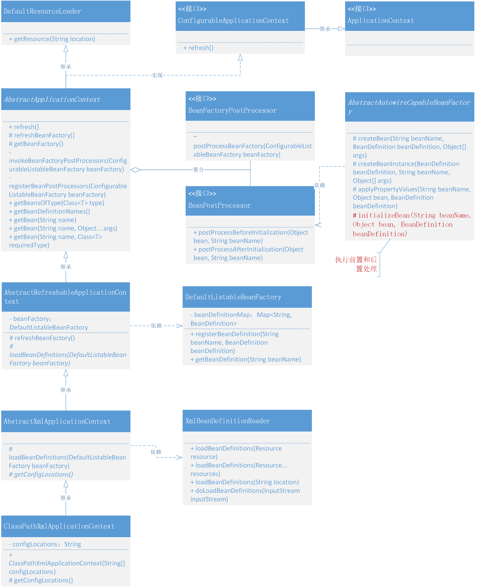
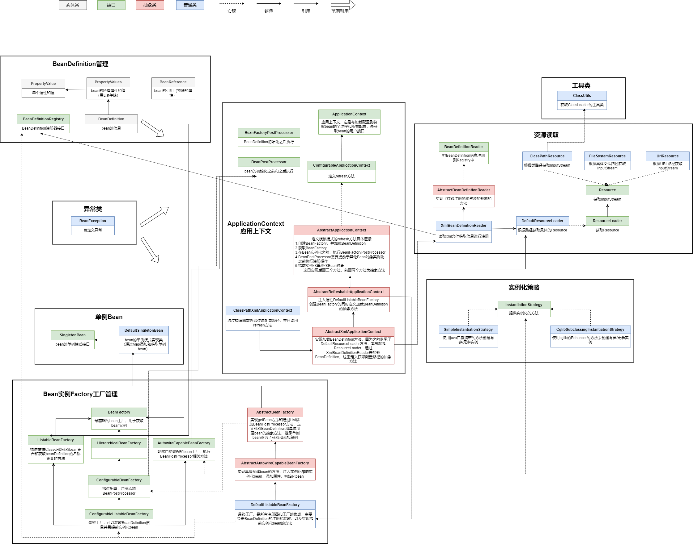

### 第六章：实现应用上下文

`学习重点`

引入上下文，进行资源扫描与加载，为Bean对象实例化过程添加扩展机制，允许加载Bean对象和在其实例化前后积习进行修改和扩展。

`学习收获`

1. 在我们学习的过程中，其实很像把控一个具有复杂需求的研发设计和实现过程。解决这类复杂场景的设计主要分为——分治、抽象和知识3个方面，运用架构和设计模式的知识，在分治层面将一个大问题分为若干个子问题，而问题越小就越容易被理解和处理。
2. 本章的新增内容是要将Bean对象的扩展机制功能和对Spring框架上下文的包装进行整合，以提供完整的服务。
3. 如上图2，我们需要新增BeanFactoryPostProcessor，BeanPostProcessor接口，以及其实现类；新增上下文ApplicationContext，ConfigurableApplicationContext接口，以及其抽象类AbstractApplicationContext，AbstractRefreshableApplicationContext，AbstractXmlApplicationContext，以及其实现类ClassPathXmlApplicationContext；新增AbstractAutowireCapableBeanFactory的initializeBean方法。
   - BeanFactoryPostProcessor接口是在所有的BeanDefinition加载完成后，且将Bean对象实例化之前，提供修改BeanDefinition属性的机制
   - BeanPostProcessor接口提供了Bean对象执行初始化方法之前和之后的扩展点。
   - ApplicationContext继承ListableBeanFactory，但目前不需要添加获取ID和父类上下文的方法，暂时没有该接口方法的定义。（ApplicationContext具有自动识别、资源加载、容器事件和事件监听器等功能）
   - ConfigurableApplicationContext继承ApplicationContext，定义了一个重要的方法——refresh方法。
   - AbstractApplicationContext实现ConfigurableApplicationContext、继承DefaultResourceLoader，其中refresh方法定义及实现过程如下：
      - 创建BeanFactory，并加载BeanDefinition
      - 获取BeanFactory
      - 在将Bean对象实例化之前，执行BeanFactoryPostProcessor操作
      - BeanPostProcessor需要在将Bean对象实例化之前注册
      - 提前实例化单例Bean对象
      - 将定义的抽象方法refreshBeanFactory和getBeanFactory由继承此抽象类的其他抽象类来实现
   - AbstractRefreshableApplicationContext继承AbstractApplicationContext，定义属性DefaultListableBeanFactory，实现refreshBeanFactory和getBeanFactory方法，同时在refreshBeanFactory方法中有一个抽象方法loadBeanDefinitions。
   - AbstractXmlApplicationContext继承AbstractRefreshableApplicationContext，实现loadBeanDefinitions方法的同时定义抽象方法getConfigLocations方法。
   - ClassPathXmlApplicationContext，定义属性String [ ] ，实现getConfigLocations方法，在构造函数中为属性赋值并且调用refresh方法。
   - AbstractAutowireCapableBeanFactory实现AutowireCapableBeanFactory，在createBean方法中添加initializeBean方法。
   - 测试的时候我们会根据具体的bean来实现BeanFactoryPostProcessor和BeanPostProcessor接口。
   - 对于AbstractBeanFactory我们实现的接口是ConfigurableBeanFactory,以及实现了对应的方法addBeanPostProcessor,并且相比较之前也优化了getBean方法,将不同入参的getBean方法最后统一调用doGetBean方法
   - 对于DefaultListableBeanFactory我们在原本实现接口的基础上多增加一个接口ConfigurableListableBeanFactory,注意的是
     beanDefinitionMap.keySet().forEach(this::getBean);
     这里采用方法的引用值得学习一下
5. 通过对比测试，不使用ApplicationContext明显更复杂一点，体会到上下文ApplicationContext的优势。
6. 通过本文的实现一定会非常了解 BeanFactoryPostProcessor、BeanPostProcessor，以后再做一些关于 Spring 中间件的开发时，如果需要用到 Bean 对象的获取以及修改一些属性信息，那么就可以使用这两个接口了。同时 BeanPostProcessor 也是实现 AOP 切面技术的关键所在。
7. 核心技术的原理学习，是更有助于你完成更复杂的架构设计，当你的知识能更全面覆盖所承接的需求时，也就能更好的做出合理的架构和落地。

`学习问题`

1. 在InstantiationBean遍历构造函数数组时，记得添加（null != args），否则会报空指针异常
2. 学会用debug调试代码，在一些容易报错的地方及时catch捕捉，方便查看具体异常问题

`类图`

