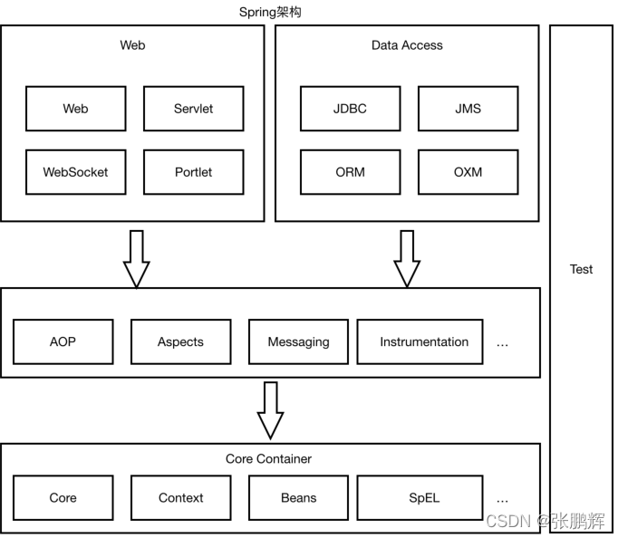
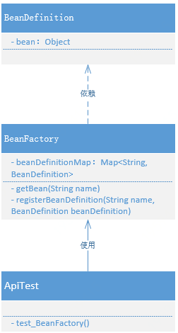

## 前言

关于Spring的源码，从我一开始接触Spring框架的时候就已经对其有着一股很浓厚的兴趣。随着学习的深入，Spring的很多东西感觉非常奇妙——于是乎我决定学习xfg的《手写Spring渐进式源码实践》。希望可以从这里不仅仅学习了解Spring的奥秘，更多的是设计模式和编程思维的提升。

`学习收获`

1. ORM框架：ORM全名是Object-Relational Mapping，即对象关系映射（实现面向对象编程语言中的对象和关系型数据库之间的映射），这里有一个很广为人知的例子那就是**Mybatis**框架。

2. Spring关系图：

   

3. SPI机制：Service Provider Interface 服务提供接口机制

## 正文

### 第一章：实现一个简单的 Spring Bean 容器

`本章重点`

基于 Spring Bean 容器的存储功能和读取功能，采用时间复杂度为O(log n)的 Hash Map 数据结构进行设计和实现。

`学习收获`

1. HashMap:

   HashMap 是一种基于扰动函数、负载因子、红黑树转换等技术内容，形成的拉链寻址的数据结构，它能让数据更加散列的分布在哈希桶以及碰撞时形成的链表和红黑树上。它的数据结构会尽可能最大限度的让整个数据读取的复杂度在 O(1) ~ O(log n) ~O(n)之间，当然在极端情况下也会有 O(n) 链表查找数据较多的情况。

2. Spring Bean 容器中需要完成Bean对象的定义、注册和获取三个基本步骤。

3. ConcurrentHashMap:

   - 允许多线程同时进行读写操作
   - 不需要同时进行外部同步（外部同步：外部显示地用同步代码块【使用关键字Synchronized】）
   - 使用分段锁（Segment）
   - 弱一致性迭代器，允许迭代过程中对哈希表进行修改