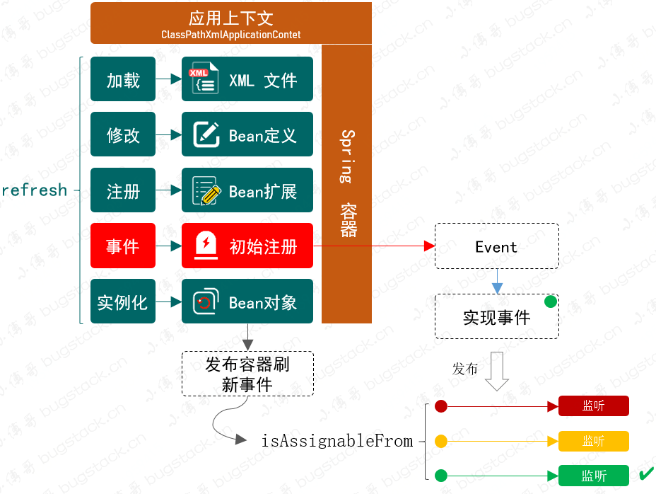
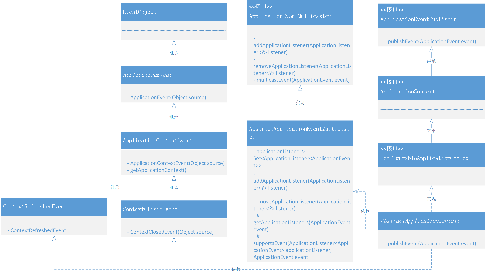
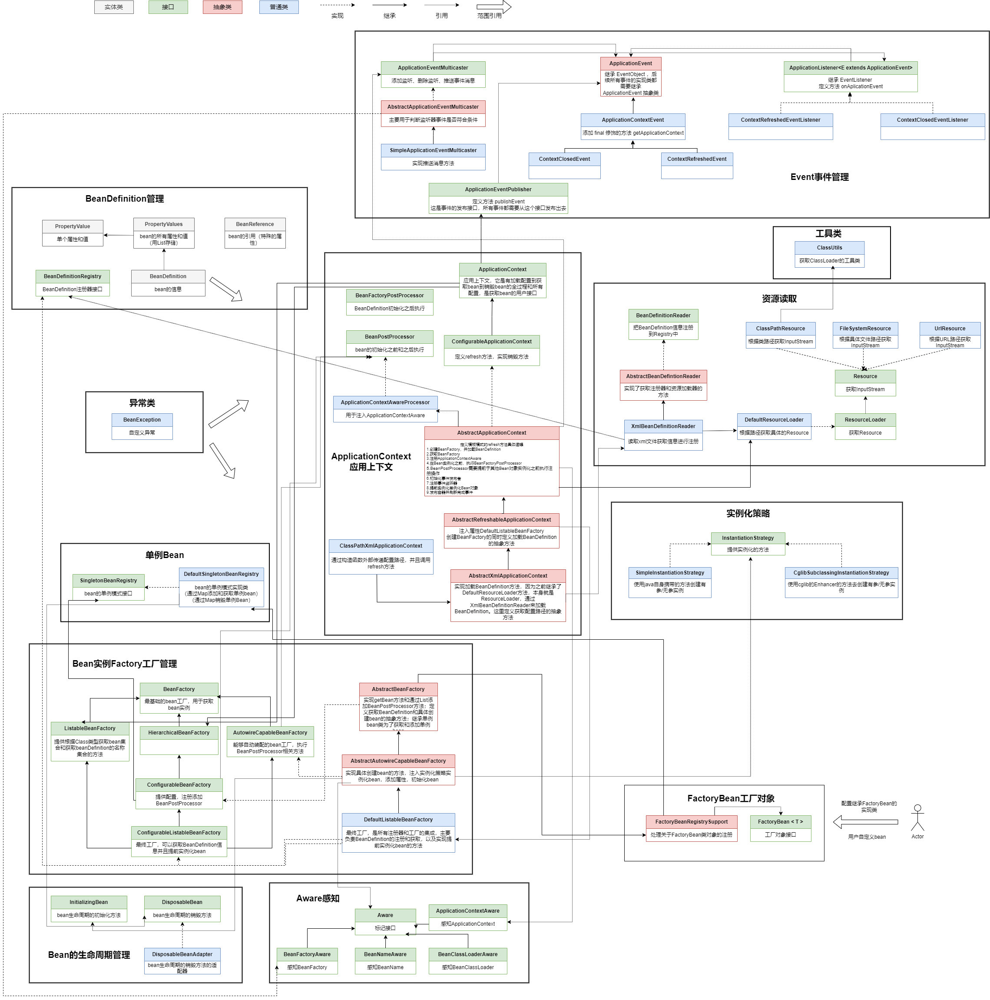

### 第十章：容器事件和事件监听器

`学习重点`

事件和事件监听器是 Spring 框架扩展出来的非常重要的功能。它通过继承 EventObject 实现对应的容器事件，并利用统一的事件处理类，将符合用户发布类型的事件筛选出来并推送到用户监听器中，以此解耦用户业务流程的逻辑。





`学习收获`

1. 本章在实现 Spring 事件的功能时，会使用观察者模式。那么我们回忆一下观察者模式是什么样的：

   介绍：观察者模式指多个对象间存在一对多依赖关系，当一个对象的状态发生改变时，所有依赖于它的对象都得到通知并被自动更新。

2. 本章需要以观察者模式的方式，设计和实现 Event 的容器事件和事件监听器的功能，最终可以在现有的、已经实现的 Spring 框架中定义、监听和发布自己的事件信息。

3. 在整个功能的实现过程中，仍然需要在面向用户的应用上下文 AbstractApplicationContext 中添加相关事件的内容，包括初始化事件发布者、注册事件监听器、发布容器完成刷新事件。

4. 在使用观察者模式多定义事件类、监听类、发布类后，还需要实现一个广播器的功能。当接收事件推送时，对接收者感兴趣的监听事件进行分析，可以使用 isAssignableFrom 进行判断。（assign 分配）

5. 接下来我们正式开始具体的代码（本章难度4星）：

   1. 定义和实现事件

      - 定义 ApplicationEvent 抽象类，继承 EventObject 。

        定义构造方法，用父类的实现。后续所有事件的实现类都需要继承 ApplicationEvent 抽象类。

      - 定义 ApplicationContextEvent ，继承 ApplicationEvent 。

         - 定义构造方法且用父类的实现。
         - 定义 final 修饰的方法 getApplicationContext 。

      - 定义 ContextClosedEvent ，继承 ApplicationContextEvent 。

        定义构造方法，用父类的实现。

      - 定义 ContextRefreshedEvent ，继承 ApplicationContextEvent 。

        定义构造方法，用父类的实现。

   2. 事件监听器

      定义 ApplicationListener<E extends ApplicationEvent> 接口，继承 EventListener 。定义方法 onApplicationEvent 用于处理应用上下文的事件。
   
   3. 事件广播器

      - 定义 ApplicationEventMulticaster 接口，定义3个方法：
         - addApplicationListener 添加监听。
         - removeApplicationListener 删除监听。
         - multicastEvent 推送事件消息。
      - 定义 AbstractApplicationEventMulticaster 抽象类，实现 ApplicationEventMulticaster 和 BeanFactoryAware 接口。
         - 定义 final 修饰的属性 LinkedHashSet 来存储事件监听器，定义属性 BeanFactory 。
         - 实现 ApplicationEventMulticaster 和 BeanFactoryAware 接口的方法。（setBeanFactory 方法为 final 修饰）
         - 添加 getApplicationListeners 和 supportsEvent 方法：
            - getApplicationListeners 方法就是遍历 set 然后调用 supportsEvent 方法判断是否符合条件，最后返回符合条件的监听器集合。
              supportsEvent 方法主要是，先判断 Cglib 还是 Simple 实例化的类型，然后获取目标Class（Cglib需要获取对应的父类）；然后提取接口获取泛型参数的class；最后用 isAssignableFrom 判断是否符合条件。
         - LinkedHashSet 和 LinkedList 虽然都有 “Linked” 这个词，但它们的用途和内部实现机制有很大的不同。前者主要用于存储不重复元素并记录插入顺序，后者主要用于高效地插入和删除元素，并且本身就是一种链表结构。
      - 定义 SimpleApplicationEventMulticaster ，继承 AbstractApplicationEventMulticaster 。添加构造方法，参数为BeanFactory；实现 multicastEvent 方法。
      - `@SuppressWarnings("unchecked")` 是 Java 中的一个注解，用于抑制编译器对未经检查的类型转换警告。
   3. 事件发布者的定义和实现

      - 定义 ApplicationEventPublisher 接口，定义方法 publishEvent 。这是事件的发布接口，所有的事件都需要从这个接口发布出去。
      - 在 AbstractApplicationContext 中：
         - 添加公有静态 final 属性 APPLICATION_EVENT_ MULTICASTER_BEAN_NAME；私有 ApplicationEventMulticaster。
         - 在 refresh 方法中添加 initApplicationEventMulticaster 、registerListeners 、finishRefresh 方法。
         - 在 close 方法中新增一个容器关闭事件。
      - 在 DefaultListableBeanFactory 中修改方法 getBeansOfType ，使用 isAssignableFrom 来判断 type 。
   4. 事件使用测试

      - 定义 CustomEvent ，继承 ApplicationContextEvent 。

        定义属性 id，message；定义构造方法，使用父类的构造方法并且注入属性。

      - 定义 CustomEventListener、ContextRefreshedEventListener、ContextClosedEventListener，继承 ApplicationListener 。

      - 定义 spring.xml 配置三个监听器实现类。

6. 我们可以通过 debug 一步步调试代码来学习和体验 spring 的设计模式。

`学习问题`

1. 及时复习集合知识！！！

2. ```java
   //(ParameterizedType) genericInterface.getActualTypeArguments()
   ```

   ```java
   //((ParameterizedType) genericInterface).getActualTypeArguments()
   ```

   括号的妙用：第一个是把最后结果转型；第二个是把前者 genericInterface 转型

3. 在测试没有打印结果，一直没有想到是 getBeansOfType 具体实现使用的 == type 。所以出现问题要一步步跟踪，每个代码想清楚逻辑！！！

`类图`

