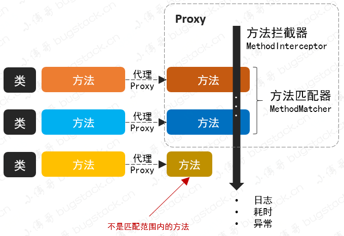
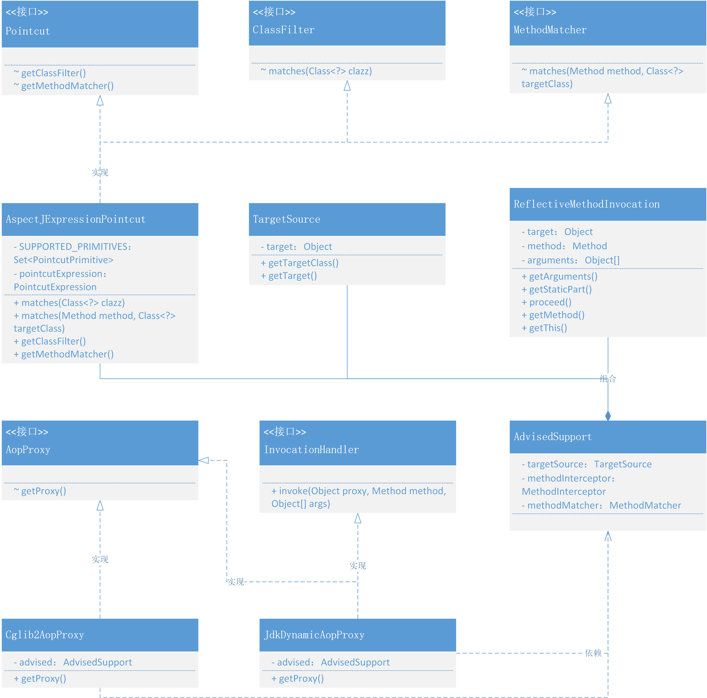
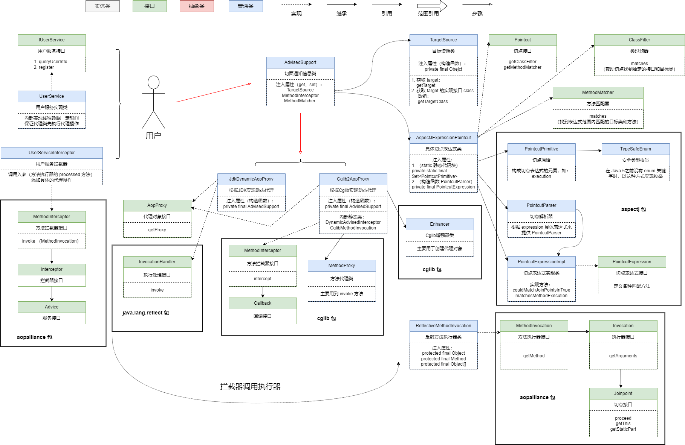

### 第十一章：基于 JDK、Cglib 实现 AOP 切面

`学习重点`

基于类的代理和方法拦截匹配器，为目标对象提供 AOP 切面处理的统一框架结构。在学习中注意先理清类的代理知识，再学习 AOP 切面的设计思路和技术实现。

`学习收获`

1. 为什么要使用 AOP：

   当为多个不存在继承关系的功能对象类提供一个统一的行为操作时，会有大量的重复代码开发或者反复调用。例如，方法监控、接口管理、日志打印等，都需要在代码块中引入相应的非业务逻辑的同类功能处理，程序代码将越来越难以维护。所以，除了 IOC 的纵向处理，也需要 AOP 横向处理进行统一的共性逻辑处理，简化程序的开发过程。

2. 使用 AOP 的好处：

   使用 AOP 可以对业务逻辑的各个部分进行隔离，从而降低各模块之间业务逻辑的耦合度，提高代码的可复用性，也能提高程序的开发效率。

3. 在开始学习之前我们最好是先了解一下动态代理，然后根据一个实例来了解其全貌。（test 文件中有代理实例）

4. 简单总结一下流程：代理对象 -> 方法匹配 -> 用户自己实现拦截方法后的操作 -> 反射调用

5. 那么我们正式开始学习本章代码

    1. 切点表达式

        - 定义接口
            - Pointcut 接口：定义获取类过滤器和获取方法匹配器方法
            - ClassFilter 接口：定义 matches 方法（用于帮助切点找到给定的接口和目标类）
            - MethodMatcher 接口：定义 matches 方法（用于找到表达式范围内匹配的目标类和方法）
        - 导入 pom 文件
            - aopalliance
            - aspectjweaver
        - 实现切点表达式类
            - AspectJExpressionPointcut 实现 Pointcut、ClassFilter、MethodMatcher 接口
            - 定义 final 修饰的私有静态属性 SUPPORTED_PRIMITIVES （Set），并且静态代码块初始化添加 PointcutPrimitive.EXECUTION
            - 定义 final 修饰的私有属性 PointcutExpression
            - 构造函数：入参是表达式具体信息，内部用到 PointcutParser 切点解析器去提供具体 pointcutExpression
            - 使用 PointcutExpression 实现接口的 matches 方法，实现获取方法直接返回 this 即可
        - 匹配验证
            - 我们这里单测一个方法，查看拦截的方法与对应的对象是否匹配

    2. 包装切面通知信息（AdvisedSupport）

        - 定义类 TargetSource
            - 定义 final 修饰的私有属性 Object
            - 定义构造函数、get 方法以及获取属性的实现接口的 class 数组方法

        - 定义私有属性 TargetSource（被代理的目标对象）、MethodInterceptor（方法拦截器）、MethodMatcher（方法匹配器）
        - getter、setter方法

    3. 代理抽象实现

        - 定义接口：AopProxy，定义获取代理对象的方法
        - 定义 ReflectiveMethodInvocation 实现 MethodInvocation 接口。定义 final 修饰的保护属性 Object、Method、Object [ ] 。实现接口的方法。
        - JdkDynamicAopProxy 实现 AopProxy、InvocationHandler 接口：
            - 定义 final 修饰的私有属性 AdvisedSupport
            - 构造方法：入参提供 AdvisedSupport
            - 根据 AdvisedSupport 的属性 TargetSource 实现接口的获取代理对象方法
            - 根据 AdvisedSupport 的属性  MethodInterceptor、MethodMatcher 和 ReflectiveMethodInvocation 实现接口的 invoke 方法
            - 这里实际上通过实现两个接口，将代理对象 getProxy 和反射调用方法 invoke 方法分开进行处理
        - Cglib2AopProxy  实现 AopProxy 接口：
            - 定义 final 修饰的私有属性 AdvisedSupport
            - 构造方法：入参提供提供 AdvisedSupport
            - 基于 Cglib 使用 Enhancer 代理的类在运行期间为接口使用底层 ASM 字节码来增强技术处理对象生成代理对象
            - 实现 getProxy 方法时，多定义了两个私有内部静态类 DynamicAdvisedInterceptor（实现 MethodInterceptor 接口）、CglibMethodInvocation（继承 ReflectiveMethodInvocation）

    4. 测试

        - 定义 IUserService 接口

        - 在 UserService 中添加两个方法
        - 定义 UserServiceInterceptor （实现接口 MethodInterceptor）用户自定义拦截器

6. 我们目前还没有与 Spring 结合，只是对切面技术的一个具体实现，这样我们可以先学习如何处理代理对象、过滤方法、拦截方法，体会使用 Cglib 和 JDK 代理的区别。

7. 一些核心技术的使用上，都是具有很强的关联性的，它们也不是孤立存在的。而这个能把整个技术栈串联起来的过程，需要大量的学习、积累、由点到面的铺设，才能在一个知识点的学习拓展到一个知识面和知识体系的建设

`类图`

