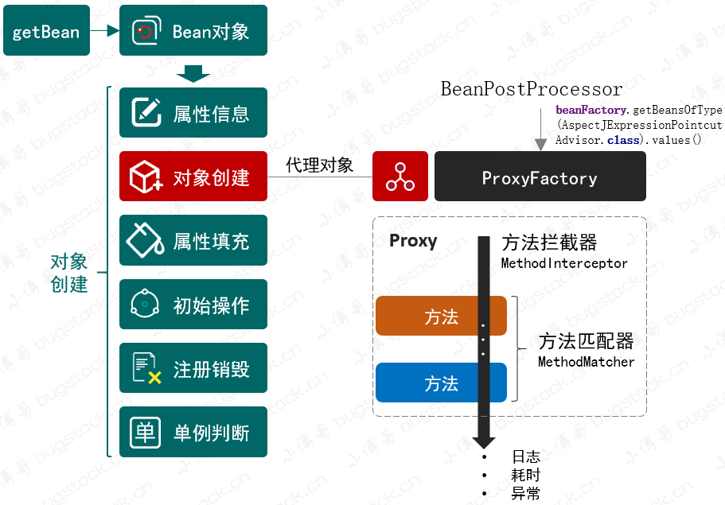
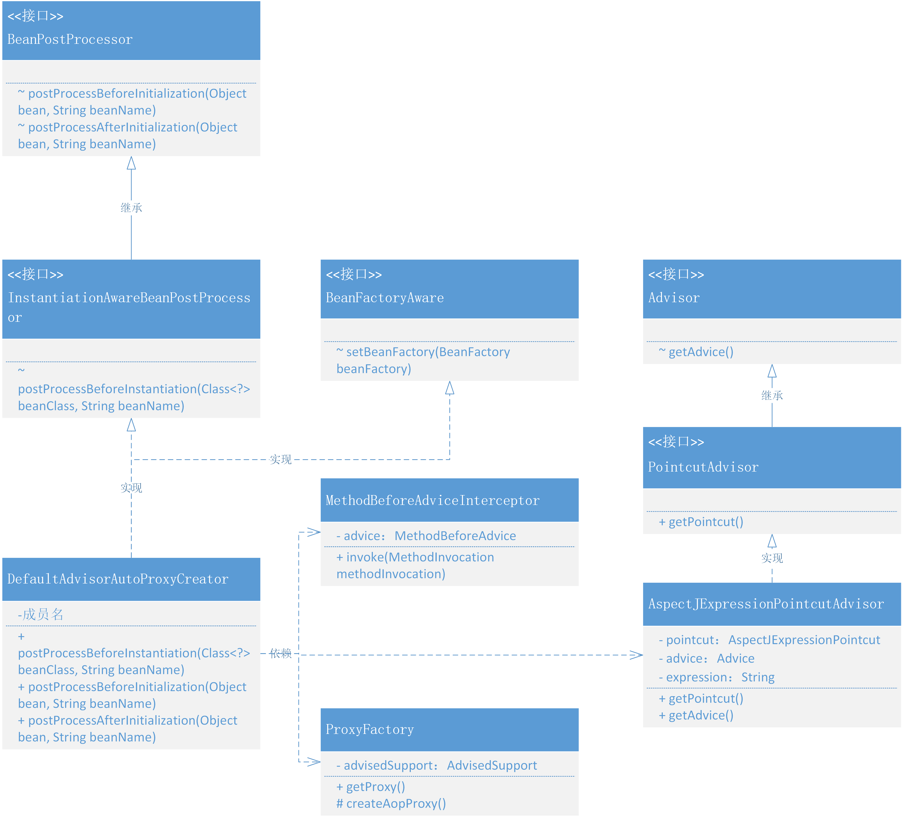
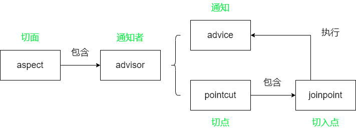
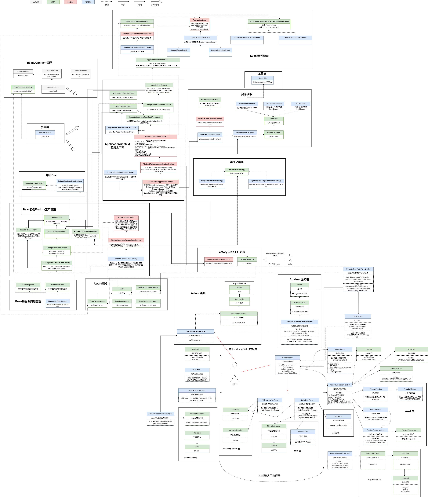

### 第十二章：把 AOP 融入 Bean 的生命周期

`学习重点`

通过代理工厂、切面拦截调用和切点表达式，借助对象实例化扩展，将代理自动化操作整合到容器中进行管理，以此实现 AOP 的切面功能。

`学习收获`

1. 上一章我们学习了 AOP 的核心功能，本章我们会将其与 Spring 框架结合，最终实现以 Spring 框架配置的方式完成切面的操作。

2. 在创建对象的过程中，需要将 XML 文件中配置的代理对象（切面中的一些类对象）实例化，会用到 BeanPostProcessor 类提供的方法来修改 Bean 对象执行初始化前后扩展信息。

3. 在开始正式学习代码之前，我们先理清一下 AOP 中的关系：

   

4. 接下来我们开始学习具体的代码：

    1. 定义 Advice 通知
        - 定义接口 BeforeAdvice （可以有 AfterAdvice ...）继承 Advice（ aopalliance 包）
        - 定义接口 MethodBeforeAdvice 继承 BeforeAdvice，定义方法 before（Method，Object []，Object）
    2. 定义 Advisor 通知者
        - 定义接口 Advisor，定义方法 getAdvice（）
        - 定义接口 PointcutAdvisor，继承 Advisor 定义方法 getPointcut（）
        - 定义实现类 AspectJExpressionPointcutAdvisor 实现接口 PointcutAdvisor
            - 注入属性，切面 private AspectJExpressionPointcut pointcut
            - 注入属性，通知 Advice advice
            - 注入属性，表达式 String expression
            - 实现接口方法
            - set 方法设置 advice 和 expression
    3. 定义方法拦截器
        - 定义实现类 MethodBeforeAdviceInterceptor 实现接口 MethodInterceptor
            - 注入属性 private MethodBeforeAdvice advice
            - 构造函数传入 advice
            - 使用 advice 实现接口 invoke 方法
    4. 代理工厂
        - 在 AdvisedSupport 中添加属性 private boolean proxyTargetClass 默认为 false ，添加其 getter（isProxyTargetClass）、setter 方法
        - 定义类 ProxyFactory
            - 注入属性 private AdvisedSupport advisedSupport
            - 构造函数传入 advisedSupport
            - 定义方法 getProxy（），内部调用 createAopProxy（）
            - 代理工厂主要主要解决了选择 JDK 和 Cglib 两种代理的问题
    5. 融入 Bean 生命周期的自动代理创建者
        - 定义接口 InstantiationAwareBeanPostProcessor 继承 BeanPostProcessor 接口，添加方法  postProcessBeforeInstantiation（Class<?> beanClass ，String beanName）
        - 定义实现类 DefaultAdvisorAutoProxyCreator 实现接口 InstantiationAwareBeanPostProcessor，BeanFactoryAware
          - 注入属性 private DefaultListableBeanFactory beanFactory
          - 实现接口方法
          - 在 postProcessBeforeInstantiation 方法中，在 postProcessBeforeInstantiation 方法中，先调用 isInfrastructureClass（），判断是否是 Advice 、Pointcut 、Advisor 的实现类，如果是直接返回 null 无需处理；然后从 beanFactory 中获取 AspectJExpressionPointcutAdvisor 类的集合并开始遍历；从 advisor 中获取 pointcut 并获取 classFilter ，并判断是否匹配；之后根据 advisor 创建 AdvisedSupport ，最后根据 ProxyFactory 返回代理对象
    6. 修改 AbstractAutowireCapableBeanFactory
        - 因为创建的是代理对象不是之前流程里的普通对象，所以我们需要前置于其他对象的创建，即需要在 createBean 优先完成 Bean 对象的判断，是否需要代理，有则直接返回代理对象。
    7. 测试
        - 准备 IUserService，UserService
        - 准备 UserServiceBeforeAdvice 实现接口 MethodBeforeAdvice
        - 准备 spring.xml 配置文件

5. 一个功能的实现往往包括核心部分、组装部分、链接部分，为了这些各自职责的分工，则需要创建接口和类，由不同关系的继承、实现进行组装。只有明确了各个职责分工，才好灵活的扩展相应的功能逻辑，否则很难驾驭大型系统的开发和建设，也就是那种不好把握的感觉。

6. 修改一处小错误：在 AbstractAutowireCapableBeanFactory 的 initializeBean 方法中，最后应该调用的是 applyBeanPostProcessorsAfterInitialization 方法

`学习问题`

我们现在根据上下文创建 Bean 都是调用无参构造函数然后根据 Properties 注入属性，所以一定要添加无参构造函数

`类图`

