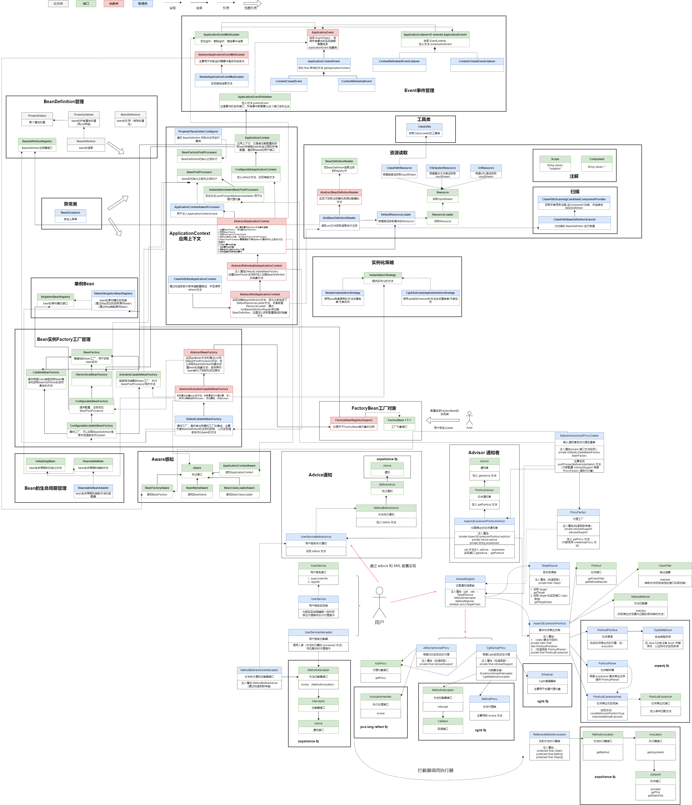

### 第十三章：自动扫描注册 Bean 对象

`学习重点`

定义属性标识、对象的注解方式，当容器扫描 XML 配置时，提取 Bean 对象的属性和对象信息，将其注册到 Bean 对象的定义组中。通过这部分的自动化扫描衔接，优化对象的注册流程。

`学习收获`

1. 在 Spring 框架的早期版本中，需要一个个在 spring.xml 配置文件中配置，我们现在想要的是简化这种配置操作。所以本章节我们学习的是：包路径的扫描、注解配置的使用、占位符的填充等。
2. 首先开始学习处理占位符配置
    - 定义实现类 PropertyPlaceholderConfigurer 实现接口 BeanFactoryPostProcessor
        - 定义两个 final 修饰的静态属性 String ，分别是前缀 "${" 、后缀 "}"
        - 定义属性包路径 String location ，生成其 setter 方法
        - 实现接口方法
            - 加载属性文件获取具体值
            - 遍历所有的 BeanDefinition 的 Properties ，找到那个有占位符的值并进行替换
    - 添加测试文件和测试类进行测试
3. 然后开始学习通过对包路径的扫描，注解配置的使用
    - 定义拦截注解
        - @Scope
            - 在类和方法上使用，保留策略为运行时
            - String value() default "singleton"
        - @Component 类似的还有 @Controller @Service ......
            - 只能在类上使用，保留策略为运行时
            - String value() default ""
    - 定义处理扫描装配
        - 定义类 ClassPathScanningCandidateComponentProvider
            - 定义方法获取所有用到 @Component 注解的类并装配成 BeanDefinition 返回结果 Set
        - 定义类 ClassPathBeanDefinitionScanner 继承 ClassPathScanningCandidateComponentProvider 类
            - 定义属性 BeanDefinitionRegistry ，构造函数传递属性
            - 添加方法 doScan 入参为包路径，使用父类的方法获取 BeanDefinition 的 Set 集合，然后开始获得注解的属性值为其赋值
    - 解析 XML 中的调用扫描
        - 修改 XmlBeanDefinitionReader
            - 在得到 root 根节点时，解析 context : component - scan 节点获取其所提供的包路径然后调用 scanner 配置 BeanDefinition
    - 添加配置文件和测试类进行测试
4. 总结我们现在就是基于 IOC 和 AOP 核心来不断完善 Bean 的生命周期。

`类图`

