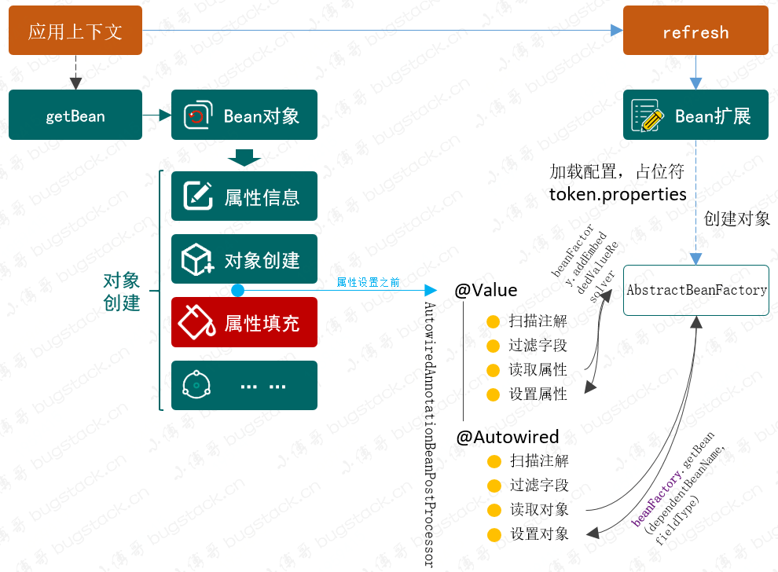
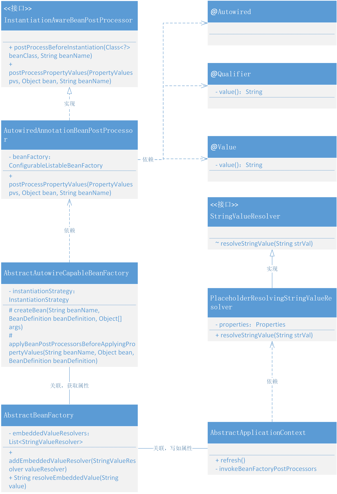
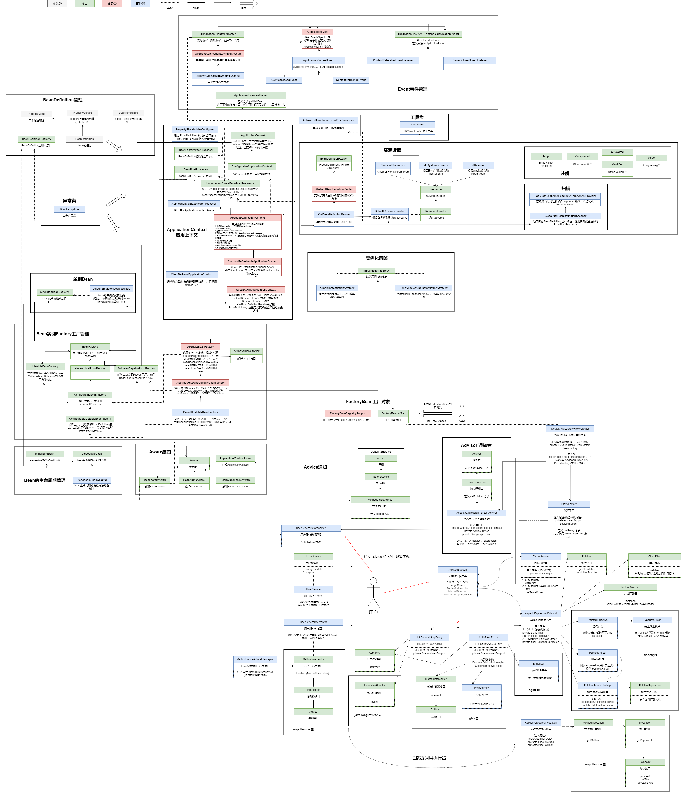

### 第十四章：通过注解注入属性信息

`学习重点`

定义属性和对象的标记性注解。在创建对象实例化后， BeanPostProcessor 的实现类通过对象获取和反射的方式对 Bean 对象中含有注解的属性字段进行属性和对象的注入。

`学习收获`

1. 在上一章我们主要使用的是手动配置 spring.xml 文件来配置 Bean 对象的操作，其实很多时候我们用到的并不是通过 xml 配置文件去配置 Bean 对象，而是通过更为方便——注解。所以本章节我们要做的就是 添加 @Value、@Autowired、@Qualifier 这三个注解去帮助我们完成对属性和对象的注解配置的注入操作。
2. 学习本章节知识前我们要知道，现在扩展的点都是围绕 Bean 的生命周期，借助 BeanPostProcessor 和 BeanFactoryPostProcessor 来实现。
3. 接下来我们正式开始学习代码~
    1. 将读取到的属性填充到容器
        - 定义解析字符串接口
            - 定义接口 StringValueResolver
            - 添加方法 String resolvesStringValue (String strVal)；
        - 填充字符串
            - 修改 ConfigurableBeanFactory 接口
              - 增加两个方法 addEmbeddedValueResolver 、resolveEmbeddedValue
            - 修改 AbstractBeanFactory 类
              - 注入属性 List<StringValueResolver> embeddedValueResolvers
              - 实现新增加的接口方法
            - 修改 PropertyPlaceholderConfigurer 类
                - 将具体解析占位符字符串的代码抽为一个方法便于使用
                - 定义内部私有类 PlaceholderResolvingStringValueResolver ，实现接口 StringValueResolver ，定义 final 修饰的私有属性 Properties ，通过构造函数传递；实现接口方法。
                - 在 postProcessBeanFactory 方法，向 BeanFactory 中添加属性解析器   
    2. 自定义注解
       - 定义注解 @Autowired
       - 定义注解 @Qualifier
       - 定义注解 @Value
    3. 扫描自定义注解
       - 在 InstantiationAwareBeanPostProcessor 接口中添加 postProcessPropertyValues 方法
       - 定义类 AutowiredAnnotationBeanPostProcessor ，实现 InstantiationAwareBeanPostProcessor 、BeanFactoryAware 接口
       - 定义私有属性 ConfigurableListableBeanFactory ，通过 BeanFactoryAware 接口实现方法传递
       - 实现 postProcessPropertyValues 方法，先判断是否为 Cglib 代理的类，然后处理注解 @Value 和 @Autowired
       - 在 ClassPathBeanDefinitionScanner 类的 doScan 方法最后添加注册 AutowiredAnnotationBeanPostProcessor 为 BeanDefinition
    4. 在 Bean 的生命周期中调用属性注入
       - 在 AbstractAutowireCapableBeanFactory 的创建 Bean 的方法中，为 Bean 对象填充属性之前允许 BeanPostProcessor 接口修改属性
       - 具体实现方法就是从 BeanFactory 中拿出所有的 BeanPostProcessor ，判断如果是 InstantiationAwareBeanPostProcessor 执行其方法，并往 BeanDefinition 中添加 PropertyValue
    5. 测试
       - 配置 Dao 、Serivice
       - 配置文件
4. 学习本章内容我们可以体会到程序设计的灵活性，无论从哪个方面扩展都可以恰当地融入整个系统中。

`类图`

