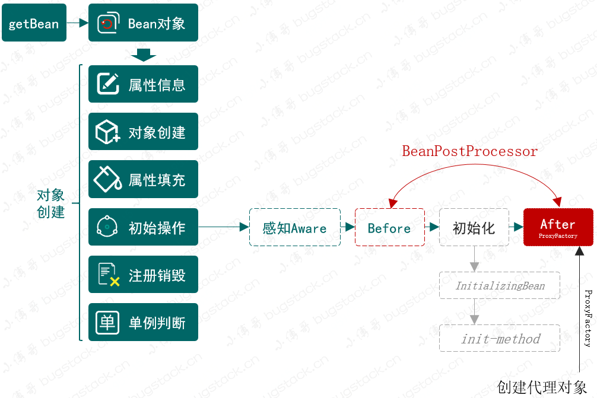
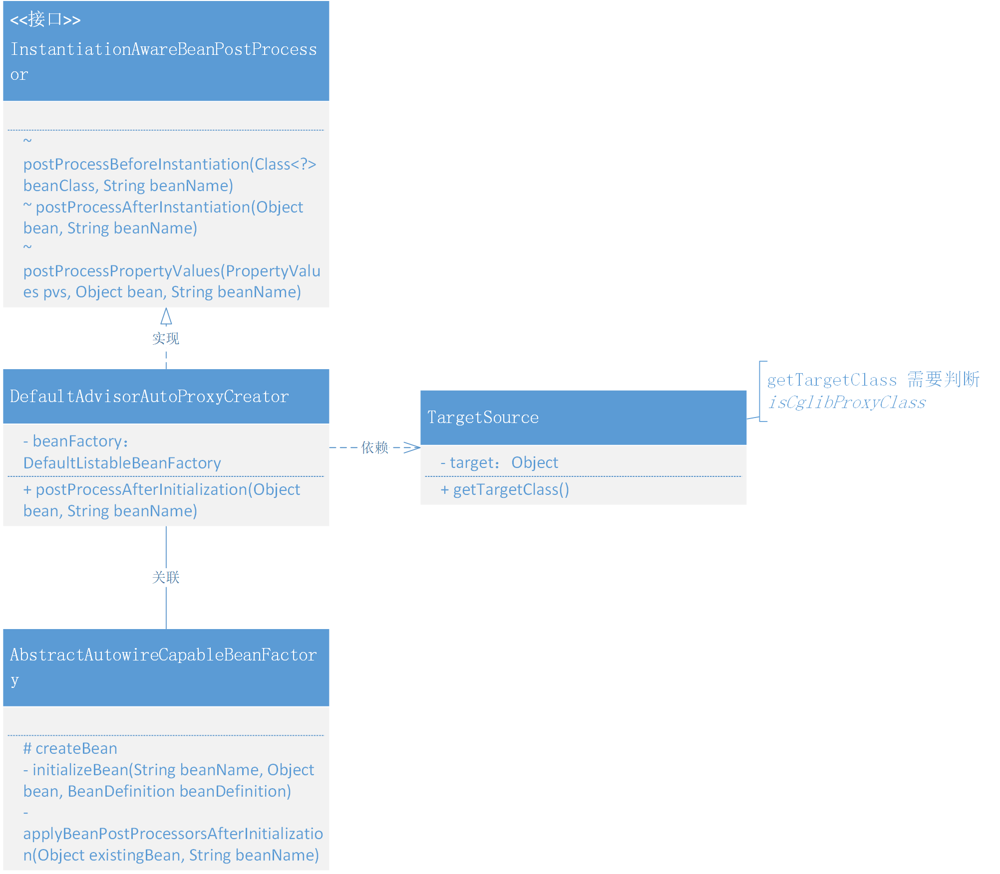
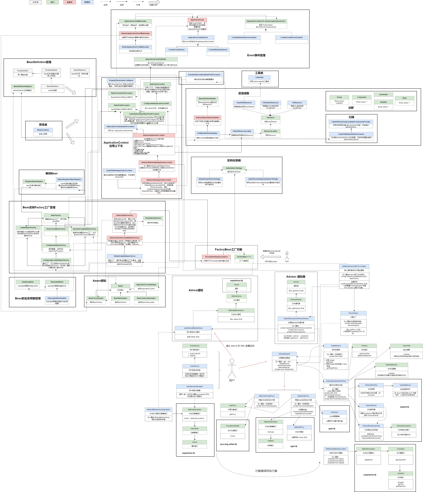

### 第十五章：给代理对象设置属性注入

`学习重点`

在处理代理对象的初始化阶段，将这个过程融入 Bean 的生命周期，并通过 TargetSource#getTargetClass 提供的代理对象判断和获取接口，用于反射注入的属性信息

`学习收获`

1. 我们目前代理对象的创建是在创建 Bean 对象之前完成的，现在的需求是我们想把这个过程加入 Bean 的生命周期，从而可以做到其他的操作，比如属性填充......
2. 在之前我们代理对象的操作是放在 BeanPostProcessor 的 Before 中，我们现在就需要放在 After 中。
3. 那么我们现在正式开始学习今天的代码，今天的任务主要是改动即可
    1. 判断 Cglib 对象
        - 在 TargetSource#getTargetClass 中，我们新增判断是否是 Cglib 代理的对象然后再进行处理，便于找到正确的接口
    2. 迁移 AOP 代理方法
        - 在 DefaultAdvisorAutoProxyCreator#postProcessBeforeInstantiation 方法的代码迁移到 postProcessAfterInitialization 中，并且在创建 TargetSource 时用已有的 bean 去创建
    3. 在 Bean 的生命周期中初始化执行
        - 在 AbstractAutowireCapableBeanFactory#applyBeanPostProcessorsAfterInitialization 中添加处理后置方法，并且在 createBean 方法中的实例化后添加判断是否需要执行后置初始化
    4. 测试
        - UserService 和配置文件
4. 这里唯一新增的点就是判断 Cglib 代理对象。目前我们越来越完善 Bean 的生命周期~

`类图`

