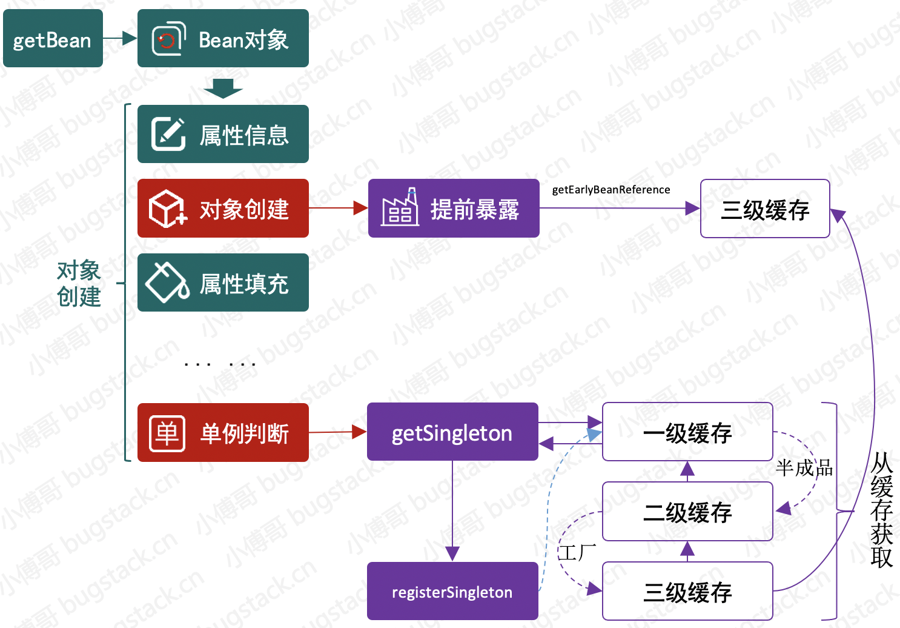
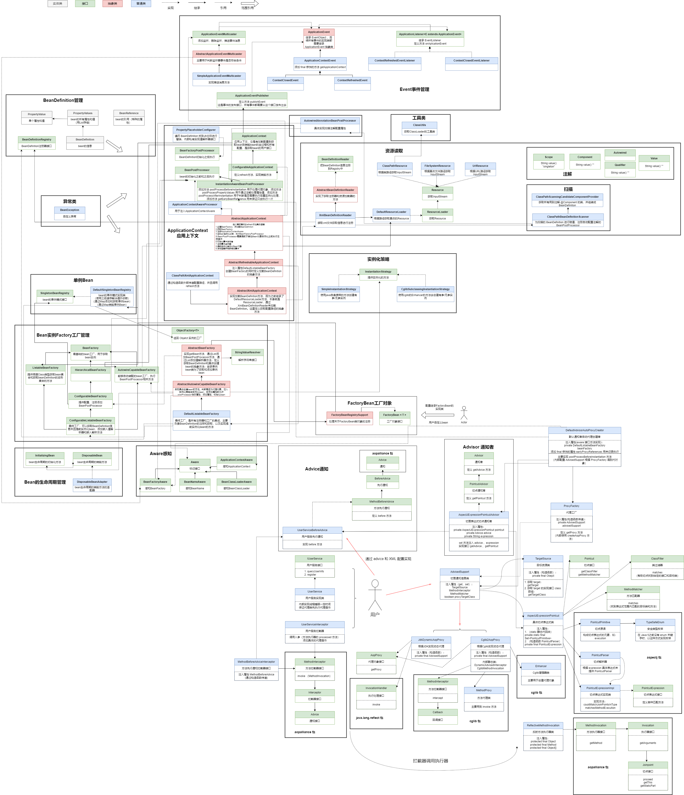

### 第十六章：通过三级缓存解决循环依赖

`学习重点`

通过一级缓存学习循环依赖对象的解决方案的核心流程，并在 Spring 框架中添加三级缓存，处理代理对象依赖和填充半成品对象，解决 Bean 对象注入时的循环依赖问题

`学习收获`

1. 本章节我们要解决的是循环依赖问题，我们先简单感受一下循环依赖：A对象有一个b属性（B对象），B对象有一个a属性（A对象），创建对象时A依赖B，B依赖A，但是他们之间不能解耦，最终产生循环依赖问题。

2. 循环依赖一般分3种情况：自身依赖、循环依赖、多组依赖

   

3. 在设计 Spring 框架的三级缓存时，我们先了解一下解决循环依赖的核心点，通过一级缓存去体会：

    - 场景：对于 A B 两个对象相互依赖，A 对象里面有属性 b 为对象B；B 对象里面有属性 a 为对象 A

    - 首先在获取 A 对象时，判断没有对象 A 的缓存，则创建半成品对象 A （newInstance）存入缓存，然后为半成品对象 A 配置属性 b，在 set 属性赋值时判断没有对象 B 的缓存，则先开始创建对象 B

    - 在创建对象 B 时，判断没有对象 B 的缓存（此时缓存中只有对象 A），则创建半成品对象 B 存入缓存，然后为半成品对象 B 配置属性 a，在 set 属性赋值时判断有半成品对象 A 的缓存，直接赋值，返回这个属性为半成品对象 A 的对象 B

    - 得到返回值后，赋值半成品对象 A 的属性 b ，返回最终结果

      > 目前缓存中：
      >
      > 对象 A 的属性 b 是属性为这个对象 A 的对象 B
      >
      > 对象 B 的属性 a 是属性为这个对象 B 的对象 A

    - 然后获取 B 对象时，判断有对象 B 的缓存直接返回最终结果

    - 至此我们解决了循环依赖

    - 为什么这样可以解决循环依赖？

      简单来说：A 创建后填充属性时依赖 B，那么就去创建 B，在创建 B 开始填充时发现依赖于 A，但此时 A 这个半成品对象已经存放在缓存到中了，所以 B 可以正常创建，在通过递归把 A 也创建完整了。

    - 总结：解决方法的核心是单例缓存和反射机制
   
    

4. 下面我们正式开始学习本章节的代码：

    1. 定义一个可以返回 Object 实例的工厂 —— （接口）ObjectFactory<T>#getObject
    2. 在 DefaultSingletonBeanRegistry 中：
        - 添加三个缓存属性 —— singletonObjects（一级缓存，完全实例化对象）、earlySingletonObjects（二级缓存，半成品对象）、singletonFactories（三级缓存，代理对象）
        - 删除原有的 singletonMap
        - 修改 getSingleton 方法 —— 先获取一级缓存，为 null 则获取二级缓存，为 null 则获取三级缓存，不为 null 则取出三级缓存中代理对象的真实对象，存入二级缓存并且删除三级缓存中的代理对象
        - 修改 registrySingleton（addSingleton） 方法 —— 存入一级缓存，删除二级缓存和三级缓存
        - 添加 addSingletonFactory 方法 —— 如果一级缓存中没有则添加三级缓存删除二级缓存
    3. 在 InstantiationAwareBeanPostProcessor 接口中添加默认方法 getEarlyBeanReference （bean，beanName）直接返回 bean
    4. 在 DefaultAdvisorAutoProxyCreator 类中：
        - 添加属性私有的 final 修饰的线程安全的 HashSet —— earlyProxyReferences
        - 将之前 postProcessAfterInitialization 方法中的代码抽取为另一个方法 wrapIfNecessary，并且修改advisedSupport.setProxyTargetClass(true);
        - 在 postProcessAfterInitialization 方法中，若 earlyProxyReferences 没有则返回执行 wrapIfNecessary
        - 实现接口方法 getEarlyBeanReference ，在 earlyProxyReferences 添加后返回执行 wrapIfNecessary
    5. 在 Cglib2AopProxy 类中：设置 enhancer 的 superclass
    6. 在 AbstractAutowireCapableBeanFactory 中：
        - 实例化 Bean 后处理循环依赖，添加三级缓存执行 addSingletonFactory
        - 添加 getEarlyBeanReference 方法，其实就是获取 BeanPostProcessor 然后判断是 InstantiationAwareBeanPostProcessor 就执行其 getEarlyBeanReference 方法
        - 最后判断单例后，根据实际情况 getSingleton ，然后 registrySingleton
    7. 我们先理一下普通对象的处理：
        - 获取 A 对象，执行 getSingleton 方法，缓存中没有任何对象，开始创建对象 A
        - 执行 addSingletonFactory 方法，添加对象 A 三级缓存删除二级缓存
        - 开始注入属性 B 对象，执行 getSingleton 方法，缓存中只有 A 的三级缓存所以我们开始创建对象 B
        - 执行 addSingletonFactory 方法，添加对象 B 三级缓存删除二级缓存
        - 开始注入属性 A 对象，执行 getSingleton 方法，返回三级缓存对象 A 的 ObjectFactory#getObject（因为是普通对象所以没有 AOP 代理操作，直接返回了这个对象），添加对象 A 二级缓存删除其三级缓存
        - 最后结束再次执行 getSingleton 方法，返回三级缓存对象 B 的 ObjectFactory#getObject（因为是普通对象所以没有 AOP 代理操作，直接返回了这个对象），添加对象 B 二级缓存删除其三级缓存
        - 执行 registrySingleton 方法，将对象 B 添加到一级缓存，删除其二级三级缓存，返回这个完整对象 B
        - 回到对象 A ，我们已经注入完成属性，至此一级缓存有完整对象 B，二级缓存有完整对象 A（因为现在已经注入属性，所以半成品对象变为完整对象） ，三级缓存无
        - 执行 getSingleton 方法，返回二级缓存完整对象A
        - 执行 registrySingleton 方法，将对象 A 添加到一级缓存，删除其二级三级缓存，返回这个完整对象 A
        - 现在我们缓存中一级缓存已经有了两个完整对象 A 和 B
        - 再接下来获取对象 B 直接返回一级缓存即可
    8. 从上面普通对象的解决，我们可以感受到，其实大致路程就是 —— 第一次 getSingleton ，addSingletonFactory ，第二次 getSingleton ，registrySingleton 。
        - getSingleton ：获取缓存，如果是三级缓存调用 ObjectFactory#getObject ；缓存升级（三级变为二级，二级一级不变）
        - addSingletonFactory  ：设置三级缓存删除二级缓存（具体 ObjectFactory 使用的是 lambda 表达式，这里封装的执行方法只有在 getSingleton 时才会用到）
        - registrySingleton : 设置一级缓存删除二级三级
    9. 接下来是我们的重点——代理对象的处理（其实也不是那么难只是多了一个 AOP 操作）：
        - 获取代理对象 A ，执行 getSingleton 方法，没有缓存，开始创建代理对象 A
        - 执行 addSingletonFactory 方法，添加代理对象 A 三级缓存删除其二级缓存
        - 开始注入属性代理对象 B ，执行 getSingleton 方法，没有缓存，开始创建代理对象 B
        - 执行 addSingletonFactory 方法，添加代理对象 B 三级缓存删除其二级缓存
        - 开始注入属性代理对象 A ，执行 getSingleton 方法，有代理对象 A 的三级缓存，那么我们执行 AOP 操作（具体用到的是 addSingletonFactory 的 lambda 表达式方法）后添加代理对象 A 的二级缓存删除其三级缓存，返回这个代理对象 A
        - 注入属性成功后，执行代理对象 B 的第二次 getSingleton 方法，有代理对象 B 的三级缓存，那么我们执行 AOP 操作后添加代理对象 B 的二级缓存删除其三级缓存，返回这个代理对象 B
        - 执行 registrySingleton 添加代理对象 B 的一级缓存删除其二级三级缓存，返回这个完整的代理对象 B
        - 回到代理对象 A ，我们已经注入完成属性，至此一级缓存有完整代理对象 B，二级缓存有完整代理对象 A（因为现在已经注入属性，所以半成品对象变为完整对象） ，三级缓存无
        - 执行代理对象 A 的第二次 getSingleton 方法，直接返回二级缓存
        - 执行 registrySingleton 方法，将代理对象 A 添加到一级缓存，删除其二级三级缓存，返回这个完整代理对象 A
        - 现在我们缓存中一级缓存已经有了两个完整代理对象 A 和 B
        - 再接下来获取代理对象 B 直接返回一级缓存即可
        - 这里我们少说了中间的一个步骤，因为我们 createBean 方法中还有 initializeBean 方法所以涉及到会执行两次 AOP 操作，在 DefaultAdvisorAutoProxyCreator 中添加的 set 集合就派上了用场，它会记录哪个 bean 代理，已经代理过的直接返回
    10. 当然还有一种情况那就是 FactoryBean ，但由于我们 FactoryBean 是单独又拉出来一条线路，并不是走的我们那个原本的 createBean 所以它执行的是自己定义的方法
    11. 测试（丈夫依赖媳妇，媳妇依赖丈夫和婆婆，其中婆婆是 FactoryBean，媳妇是 AOP 代理）

5. 我们要注意其实我们本身一级缓存或者二级缓存也可以处理，但是为了设计上的合理和可扩展性所以还是用了三级缓存。这就告诉了我们在做程序设计的时候，将要上线的功能是否能全面支撑起业务的拓展和频繁的特性。

`类图`

