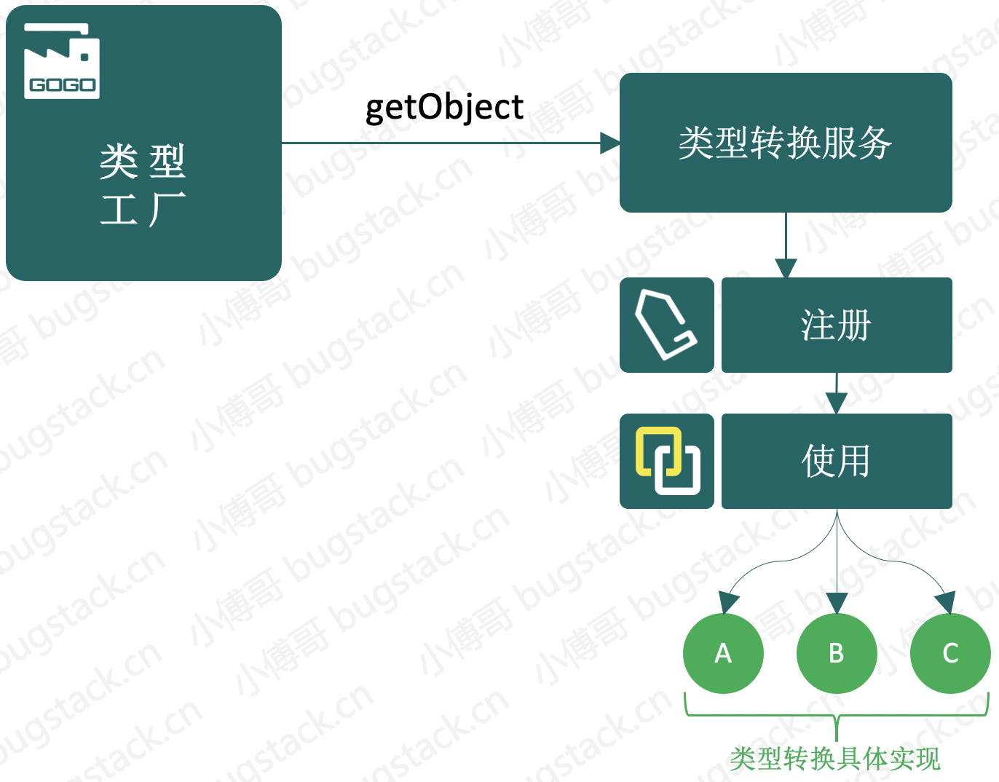
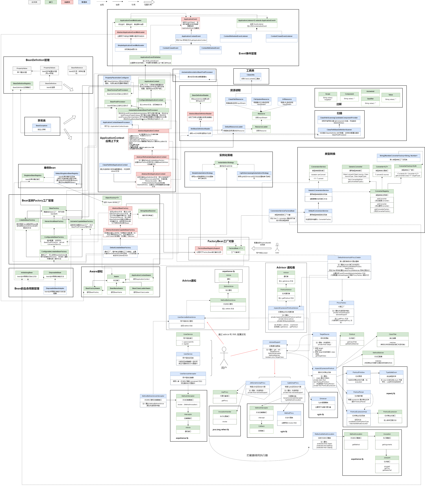

### 第十七章：数据类型转换

`学习重点`

提供定义 Java 泛型的类型转换工厂及工厂所需的类型转换服务，并把类型转换服务通过 FactoryBean 注册到 SpringBean 容器中，为对象中的属性转换提供相应的统一处理方案。

`学习收获`

1. 本章节我们开始学习类型转换。由于在属性注入时默认的都是 String 类型，但是实际上我们的类型有很多种，如 Date、Integer 等。
2. 类型转换对接 Spring 框架要基于工厂、模板的设计模式，这也是对设计模式的又一次感受。
3. 接下来我们正式学习代码：
    1. 定义类型转换接口
        - 类型转换处理接口
            - 定义接口 Converter<S,T> ，添加方法 T convert(S source)
            - 这里表示传入原数据类型 S ，转换为 T 类型
        - 类型转换工厂
            - 定义接口 ConverterFactory<S,R> ，添加方法 <T extends R> Converter<S,T> getConverter(Class<T> targetType)
            - 这里表示根据转换的目标类型来获取类型转换处理接口
        - 通用类型转换接口
            - 定义接口 GenericConverter 用于转换两个或更多类型的通用转换接口
            - 添加转换方法 Object convert(Object source, Class sourceType, Class targetType)
            - 定义 final 修饰的内部类（转换类型对儿） ConvertiblePair ，内部有两个 final 修饰的属性 Class<?> sourceType、targetType，构造函数传递判断不能为空，添加 get 方法，重写 hashCode 和 equals 方法
            - 添加方法 Set<ConvertiblePair> getConvertibleTypes() ，获取能转换的转换类型对儿
        - 类型转换注册接口
            - 定义接口 ConverterRegistry
            - 添加方法 void addConverter(Converter<?,?> converter)
            - 添加方法 void addConverter(GenericConverter converter)
            - 添加方法 void addConverterFactory(ConverterFactory<?,?> converterFactory)
    2. 类型转换工厂实现类
        - 定义实现类 String2NumberConverterFactory 实现接口 ConverterFactory<String,Number>
        - 实现接口方法
            - 返回内部类 String2Number（实现接口 Converter，内部调用 NumberUtils.parseNumber 方法）
    3. 实现类型转换服务
        - 类型转换服务接口
            - 定义接口 ConversionService ，这是用于类型转换的服务接口，是转换系统的切入点
            - 添加方法 boolean canConvert(@Nullable Class<?> sourceType, Class<?> targetType)
            - 添加方法 <T> T convert(Object source, Class<T> targetType)
        - 通用类型转换服务实现类
            - 定义实现类 GenericConversionService 实现接口 ConversionService 、ConverterRegistry
            - 注入属性 Map<GenericConverter.ConvertiblePair，GenericConverter> converters
            - 实现接口方法
                - canConvert：通过 sourceType 和 targetType 尝试获取 GenericConverter，判断是否为空
                - convert：通过 source 和 targetType 获取 GenericConverter，执行其 convert 方法
                - addConverter（参数为 Converter）：将传入的 convert 转换为 GenericConverter.ConvertiblePair，构建类型转换适配器，获得其类型转换对儿，从而添加进 Map converters 中
                - addConverter（参数为 GenericConverter）：获得其类型转换对儿然后添加进 Map converters 中
                - addConverterFactory：将传入的 convertFactory 转换为 GenericConverter.ConvertiblePair，构建类型转换工厂适配器，获得其类型转换对儿，从而添加进 Map converters 中
        - 默认类型转换服务实现类
            - 定义实现类 DefaultConversionService 继承 GenericConversionService
            - 构造函数调用 addConverterFactory 方法，添加 String2NumberConverterFactory
    4. 接入 Bean 生命周期
        - 类型转换服务 FactoryBean
            - 定义实现类 ConversionServiceFactoryBean 实现接口 FactoryBean<ConversionService>、InitializingBean
            - 定义属性 Set<?> converters、GenericConversionService conversionService
            - 添加 set 方法注入 converters
            - 实现接口方法
                - getObject、getObjectType、isSingleton
                - afterPropertiesSet：创建实例 DefaultConversionService 赋值属性 conversionService，添加注册方法注册
        - 修改 ConfigurableBeanFactory 接口
            - 添加方法 ConversionService getConversionService();
            - 添加方法 setConversionService
        - 修改 AbstractBeanFactory 抽象类
            - 添加属性 ConversionService conversionService
            - 实现新接口方法
        - 修改 AbstractAutowireCapableBeanFactory
            - 在填充属性时，如果判断 value 不是 BeanReference 那么执行类型转换操作
        - 修改 AbstractApplicationContext
            - 在 refresh 方法中添加方法设置类型转换器
    5. 测试准备
4. 总结：由于我们现在 Spring 框架扩展性良好所以很方便地添加了新的功能。在此期间用到了适配器的设计模式。简单回顾一下——适配器模式一般用于当下的接口不能与已有的类一起工作，可以通过创建适配器类注入类来去实现这个接口，使得原本不能一起工作的类与接口在一起工作。

`类图`

