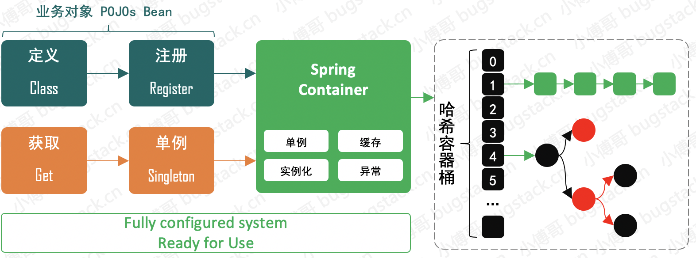
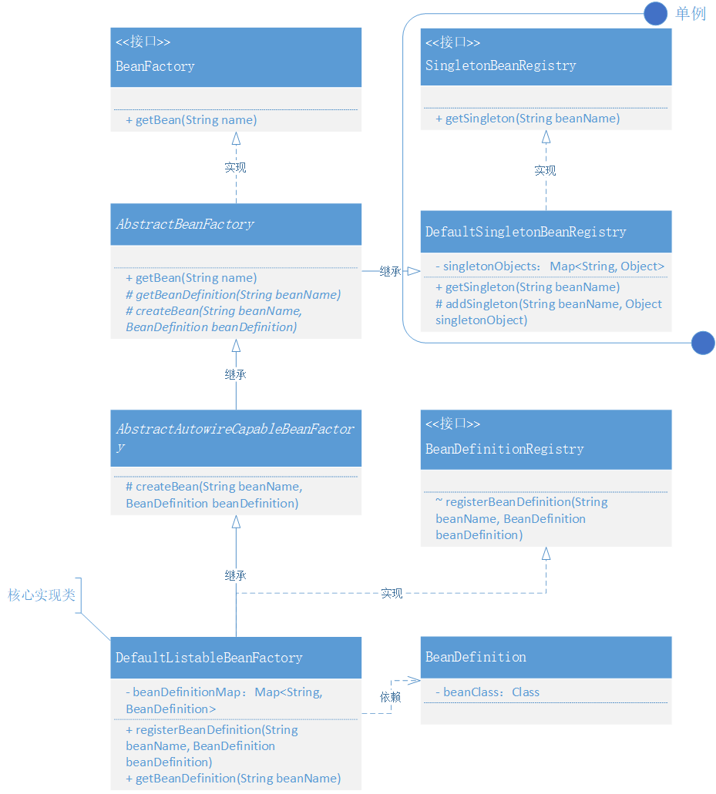

### 第二章：实现Bean对象的定义、注册和获取

`学习重点`

我们通过使用AbstractBeanFactory抽象类，运用模版模式拆分功能，解耦 Spring Bean 容器，处理上下文关系，完成 Bean Factory 接口的实现。

`学习收获`

1. 根据上一章的内容，我们要把具体职责分开，比如创建实例对象、关于单例对象、注册和定义操作等等。
2. 根据接口、抽象类的继承和实现来体现各司其职的特点。要重点关注类之间的职责和关系。
3. 我们把它简单分为 bean、singleton、beandefinition、factory、exception、test 这六个部分：
   - bean包只是简单的实例bean，如我们可以定义的 UserService 。
   - singleton包也就是单例模式包，这里包括SingletonBeanRegister接口和其实现类DefaultSingletonBeanRegister。它的作用是产生单例和存储单例。
   - beandefinition包起到的是bean定义和注册作用，这里包括类BeanDefinition类和BeanDefinitionRegister接口。
   - exception包是自定义异常。
   - test包就是测试类。
   - factory包是主线包，从接口BeanFactory到抽象类AbstractBeanFactory再到抽象类AbstractAutowireCapableBeanFactory最后到实现类DefaultListableBeanFactory，它与其他包相关联是要理清楚的重点。
4. 根据第一章的学习，可以把上面的包根据功能划分：
   - bean的定义：beandefinition
   - bean的注册：beandefinition、factory
   - bean的获取：singleton、factory
   由此我们更加可以看出，主线流程就是factory，factory连接了其他各类的包。