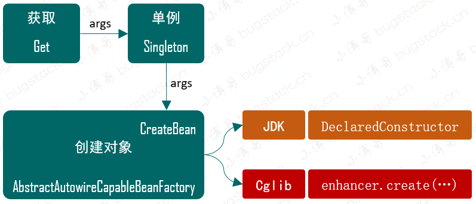
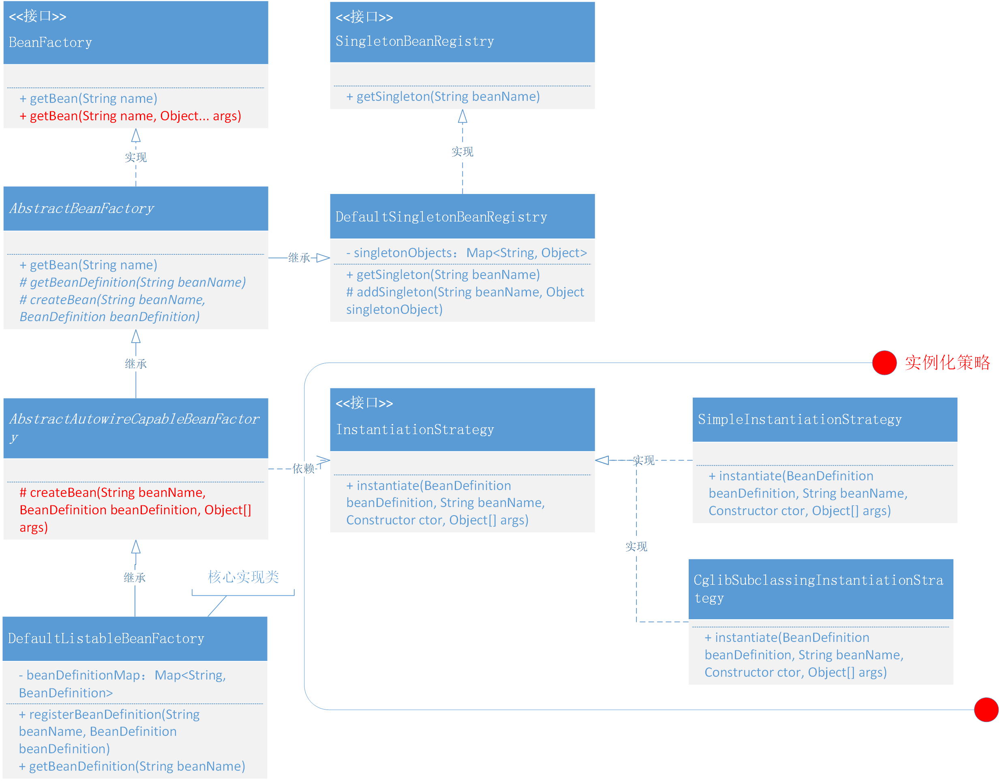

### 第三章：基于Cglib实现含构造函数的类实例化策略

`学习重点`

基于策略模式实现两种用于实例化对象的方法，如JDK、Cglib，并基于此方法实现含有带入参信息的构造函数的类实例化策略。

`学习收获`

1. 开头讲到基于策略模式实现实例化对象的方法，这里我们首先介绍一下策略模式。

   策略模式：通过对算法的封装把算法的责任和算法的实现分隔开，并委派给不同对象对这些算法进行管理。（多个类实现统一接口，有一个策略控制类通过接口来控制具体策略）

2. 从上一章的学习中，我们是直接class.newInstance()，这里假如外部有入参信息时会抛出异常。从这里开始我们也是引出这一章的学习。

3. 在学习本章之前，我们主要考虑两个方面的问题：

    - 一方面是如何将构造函数的入参信息合理地传递到实例化中
    - 另一方面是如何将含有带入参信息的构造函数的类实例化

4. 第一个问题很容易解决，直接在getBean方法的入参信息加一个参数，如(Object... args)。

5. 第二个问题是本章重点要解决的问题，具体实例化的方式有两种：

    - 一种是基于Java本身自带的方法DeclaredConstructor
    - 另一种是使用Cglib动态创建Bean对象

6. Cglib（Code Generation Library）是一个强大的高性能的代码生成库，被广泛用于字节码操作。并且Cglib是基于ASM字节码框架实现的，可以直接通过ASM指令码创建Bean对象。

7. ASM是可以直接以二进制形式来处理编译后的类，能用于修改已有的类或动态生成新的类；ASM 的核心是基于访问者模式，通过定义一系列的访问者类来遍历字节码的结构。

8. 观察者模式指多个对象间存在一对多的依赖关系，当一个对象的状态发生改变时，所有依赖于它的对象都得到通知并被自动更新。

9. Constructor是java.lang.relect包下的类，使用时可以获取与入参信息相对应的构造函数。

10. 当然这里有一个问题就是如何判断具体构造函数（根据入参个数和入参类型）

11. 在判断入参类型时我们遇到了java的自动装箱原理,所以尽可能把类的属性定义为包装类型

12. 最后通过本章的学习我们要有一个意识，就是尽可能考虑如何保证良好的扩展性及拆分类的职责。