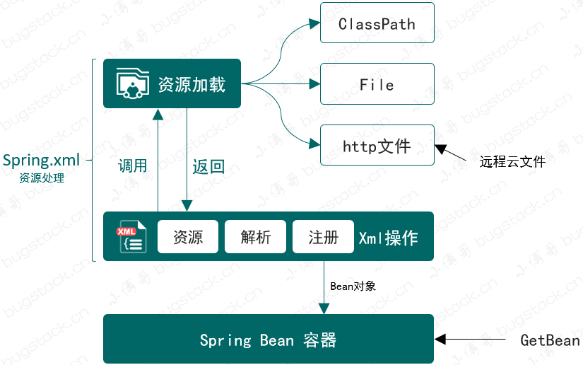
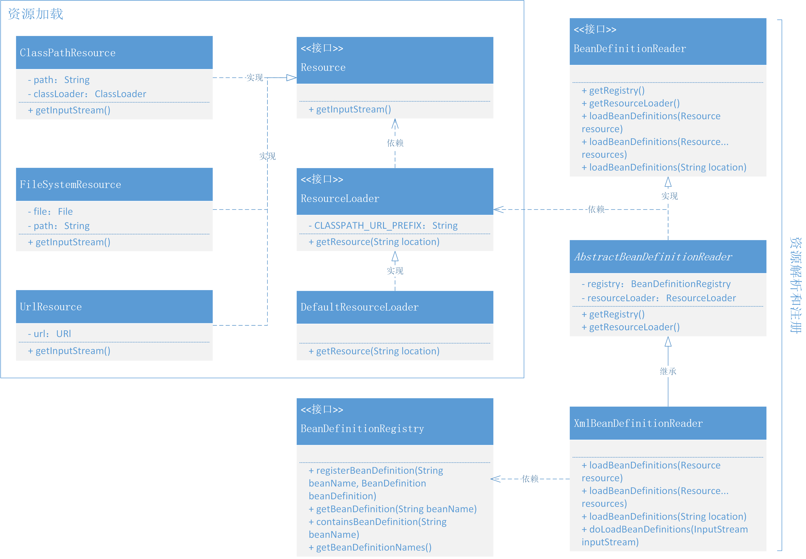
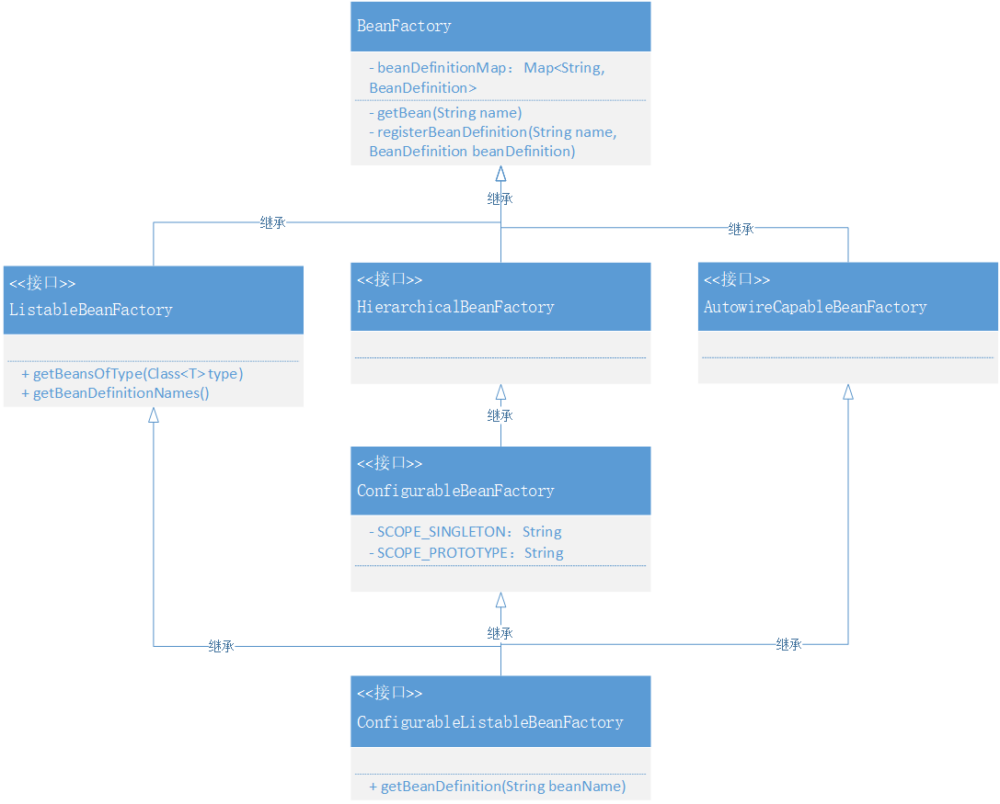

### 第五章：资源加载器解析文件注册对象

`学习重点`

定义用于解析XML文件的XmlBeanDefinitionReader类，处理用户配置在XML文件中的Bean对象信息，完成自动化配置和注册Bean对象。

`学习收获`

1. 首先点明一点，通常我们承接需求都是用if else来完成的，我们在这次Spring框架的学习中，我们更要理解的是它的设计技巧，并能运用到实际开发中。
2. 在前面部分的学习中，我们已经得到了Spring框架的雏形，但是在实际使用的过程中，是不太可能让用户自己通过手动方式创建对象的，而是一般要通过Spring配置文件来简化创建过程，把bean对象的定义、注册放到Spring配置文件中进行处理。于是乎我们开始了这一章节的学习。
3. 为了将Bean对象的定义、注册和初始化交给spring.xml配置文件进行处理，需要实现两部分内容——资源加载器和XML资源处理类：
   - 资源加载器（对Resource接口、ResourceLoader接口的实现）
   - XML资源处理类（对BeanDefinitionReader接口的实现）
4. 这里我们还根据源码拓展了一下接口的继承和实现关系，具体可以看上图3：
   - BeanFactory多增加了一个<T> T getBean(String name, Class<T> requiredType)方法
   - ListableBeanFactory，是一个扩展 Bean 工厂接口的接口，新增加了 `getBeansOfType`、`getBeanDefinitionNames()` 方法，在 Spring 源码中还有其他扩展方法。
   - HierarchicalBeanFactory，在 Spring 源码中它提供了可以获取父类 BeanFactory 方法，属于是一种扩展工厂的层次子接口。*Sub-interface implemented by bean factories that can be part of a hierarchy.*
   - AutowireCapableBeanFactory，是一个自动化处理Bean工厂配置的接口，目前案例工程中还没有做相应的实现，后续逐步完善。
   - ConfigurableBeanFactory，可获取 BeanPostProcessor、BeanClassLoader等的一个配置化接口。
   - ConfigurableListableBeanFactory，提供分析和修改Bean以及预先实例化的操作接口，不过目前只有一个 getBeanDefinition 方法。
5. 接下来我们具体看一下本章的重点内容之一，资源加载器。Resource接口有一个得到加载流的方法，它有三个实现类，ClassPathResource（类路径）、FileSystemResource（本地文件）、URLResource（通过HTTP读取远程云文件）；ResourceLoader接口有一个得到Resource的方法同时定义属性CLASSPATH_URL_PREFIX，具体实现类是DefaultResourceLoader，就是根据属性判断返回具体哪个Resource。
6. 然后我们看另一个重点内容，XML资源处理类。BeanDefinitionReader接口有五个方法，获取register，获取ResourceLoader，单个Resource参数的加载方法，多个Resource参数的加载方法，具体路径参数的加载方法。然后是一个抽象实现类AbstractBeanDefinitionReader，这个实现了前面两个方法，最后是最终实现类XmlBeanDefinitionReader，这个实现的是后面三个方法，它们调用的是doLoadBeanDefinitions方法，也是本章最复杂的方法，下面我们开始具体介绍。
7. doLoadBeanDefinitions方法：
   1. 先获取根目录的子节点集合，然后开始遍历集合
   2. 判断集合的item是否是元素，判断集合的item的node名字是否为"bean"
   3. 开始解析标签，获取bean，id，name，className（class），进而获取clazz，beanName
   4. 定义beanDefinition后，获取bean的子节点集合，然后开始遍历
   5. 判断集合的item是否为元素，判断集合的item的node名字是否为"property"
   6. 开始解析标签，获取property，attrName，attrValue，attrRef，进而获取value
   7. 定义PropertyValue，并添加到BeanDefinition中
   8. 判断在registry中是否已经注册，再进行注册bean
8. 这里我们可以理一下本章新加知识的关系，BeanDefinitionReader -> InputStream -> (不同种类)Resource -> ResourceLoader。
9. 现在我们的Spring工程结构已经越来越完善了，先在配置文件中解析并注册Bean的信息，再通过Bean工厂获取Bean对象，并进行相应的调用。
   
`学习问题`

令我最苦恼的事情就是，因为实际上ClassPath路径只需要具体文件名称，我没有去掉 “classpath:” 导致重复测试调整浪费了很多时间，以及在自己着急写代码过程中部分的小失误。总结就是测试的重要性以及写代码过程中要认真思考，不能走神糊里糊涂的。