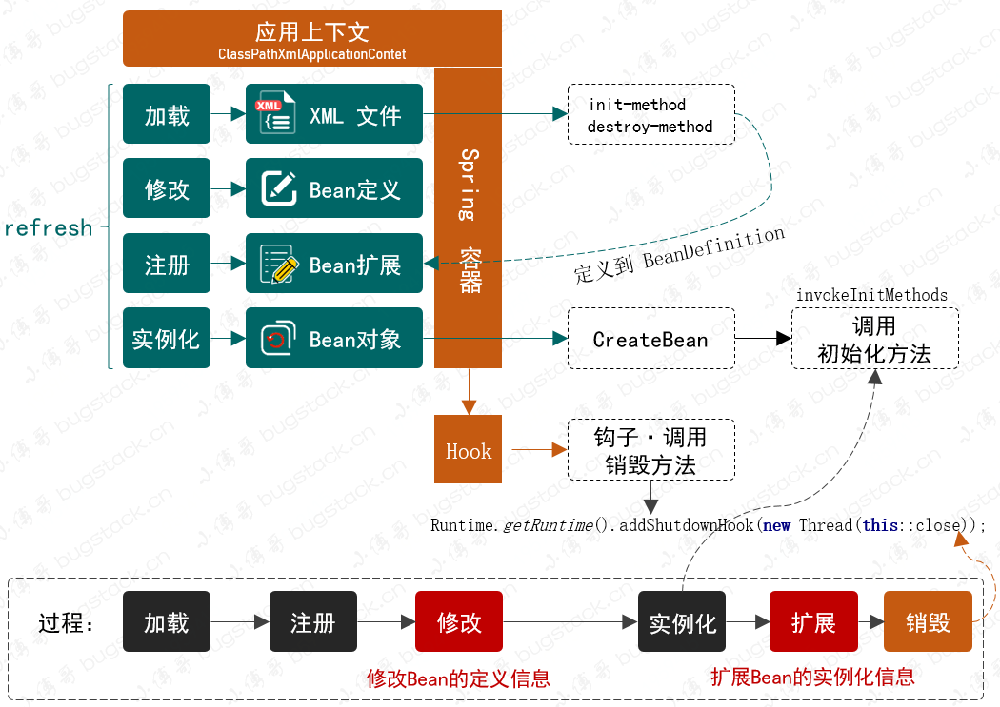
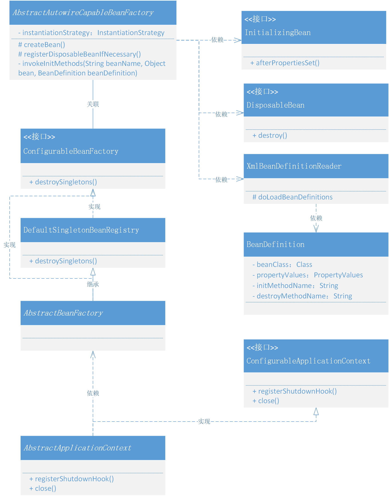
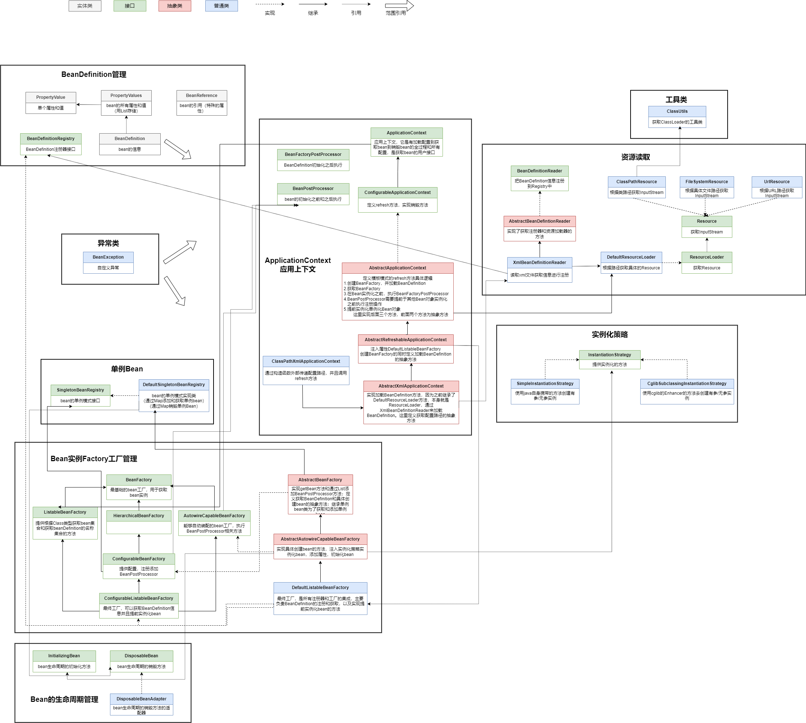

### 第七章：Bean对象的初始化和销毁

`学习重点`

在XML配置中添加注解 init-method 、destroy-method，扩展Bean对象在实例化过程中的初始化，以及向虚拟机注册钩子并在退出程序时销毁。

`学习收获`

1. 在逐步完善Spring框架的过程中，我们了解了面向对象开发的特性，如 封装、继承、多态等。

2. 这些特性通过定义接口、接口继承接口、由抽象类实现接口、类继承的类实现了接口方法，使程序逻辑做到分层、分区和分块，并将核心逻辑层和功能的使用进行封装隔离。

3. 当功能需要变更迭代时，只需要在合适的层完成装配即可，不会影响核心逻辑。

4. 在本节我们有三种方式实现：

    - 在XML中配置初始化和销毁的方法
    - 通过实现类的方式自行包装处理
    - 采用注解的方式进行初始化（后续完善）

5. 因为反射调用和接口直接调用时两种方式，所以需要使用适配器进行包装。那么我们先介绍一下适配器模式：

   适配器模式（有时候也称为包装模式或者包装）是将一个类的接口适配成用户所期待的。一个适配允许通常因为接口不兼容而不能在一起工作的类工作在一起，做法是将类自己的接口包裹在一个已存在的类中。

6. 我们一般采用的是谁实现接口谁完成实现类，而不是把实现接口又交给继承的父类处理。但后者这种方式是一种不错的隔离服务分层的设计技巧，可以在一些复制的业务场景中使用。

7. 接下来，我们正式开始学习本章节新增的知识

    - 定义初始化和销毁方法的接口：

        1. 定义接口InitializingBean，并且定义方法afterPropertiesSet（在Bean对象属性填充完成后调用）
        2. 定义接口DisposableBean，并且定义方法destroy
        3. 我们经常用InitializingBean和DisposableBean两个接口方法对参数进行初始化和销毁，如接口暴露、数据库数据读取、配置文件加载等。

    - Bean属性定义新增初始化和销毁：

      在BeanDefinition中新增两个属性——initMethodName、destroyMethodName（String类型），目的是在spring.xml配置文件的Bean对象中可以配置。
      
      在XmlBeanDefinitionReader中添加对init-method、destroy-method的读取和配置。

    - 执行Bean对象的初始化方法：

        1. 在AbstractAutowireCapableBeanFactory抽象类中，我们接着完善了上次未完成的invokeInitMethods方法
        2. invokeInitMethods方法主要分为两部分，判断InitializingBean接口，调用bean的afterPropertiesSet方法；判断配置信息init-method是否存在，执行反射调用方法
        3. 直到这里，我们在Bean对象初始化过程中，使用createBean和invokeInitMethods这两种方法都可以处理加载Bean对象中的初始化，使用户可以扩展额外的处理逻辑。

    - 定义销毁方法适配器：

        1. 新增适配类DisposableBeanAdapter（实现DisposableBean接口），具体实现与初始化方法类似
        2. 定义属性bean（final）、beanName（final）、destroyMethodName，通过构造函数赋值属性，实现destroy方法
        3. destroy方法先判断DisposableBean接口，执行bean的destroy方法；判断配置信息destroy-method是否存在以及不能同时配置和实现接口，执行反射调用方法

    - 修改singleton模块的类与接口

        1. 为了适配现在的bean生命周期的销毁方法，我们更改现在的单例模块
        2. 接口SingletonBean改名为SingletonBeanRegistry，并且在原先拥有的getSingleton方法基础上，添加destroySingletons方法
        3. 实现类DefaultSingletonBean改名为DefaultSingletonBeanRegistry，在原有的基础上添加final修饰的map用来存储disposableBeans，新增registerDisposableBean方法和实现destroySingletons方法（倒序遍历删除） 
   
    - 创建Bean对象时注册销毁方法：

        1. 在AbstractAutowireCapableBeanFactory的createBean方法中的添加registerDisposableBeanIfNecessary方法
        2. 实现registerDisposableBeanIfNecessary，判断是否实现了DisposableBean接口或者配置信息destroy-method，然后注册销毁方法，将其保存起来方便销毁时调用

    - 注册、关闭虚拟机钩子的方法：

        1. 在ConfigurableApplicationContext接口中添加registerShutdownHook、close方法
        2. 在AbstractApplicationContext抽象类中实现
        3. 这里先把ConfigurableBeanFactory继承SingletonBeanRegistry接口，这样就可以用到其destroySingletons方法
        4. Runtime.getRuntime().addShutdownHook ，在一些中间件和监控系统的设计中也可以使用这个方法，如监测服务器宕机、备机启动

    - 在测试bean中，UserDao使用xml配置信息的方法，UserService使用实现接口的方法

      在spring.xml文件中添加init-method和destroy-method的配置信息
      
      在测试类中添加 applicationContext.registerShutdownHook()

8. 我们在动手学习过程中，特别注意对接口和抽象类的把握和使用，可以将其应用到业务系统的开发中，处理一些复杂逻辑的功能分层，增加程序的可扩展。易维护等特性。

`类图`

