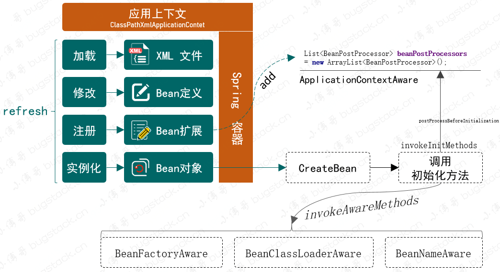
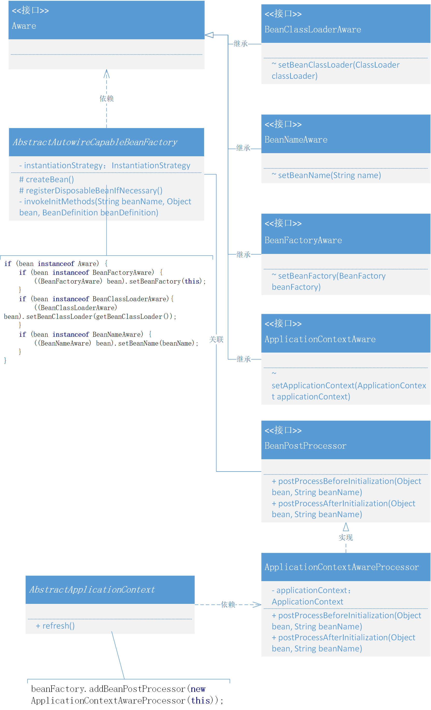
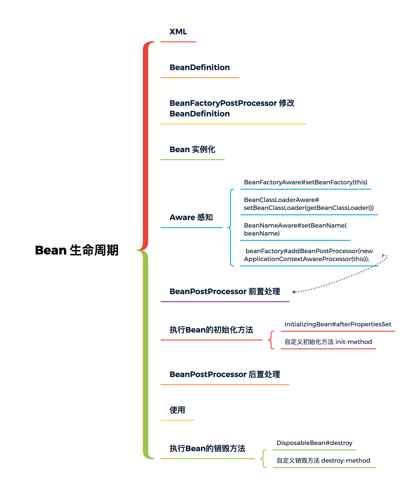
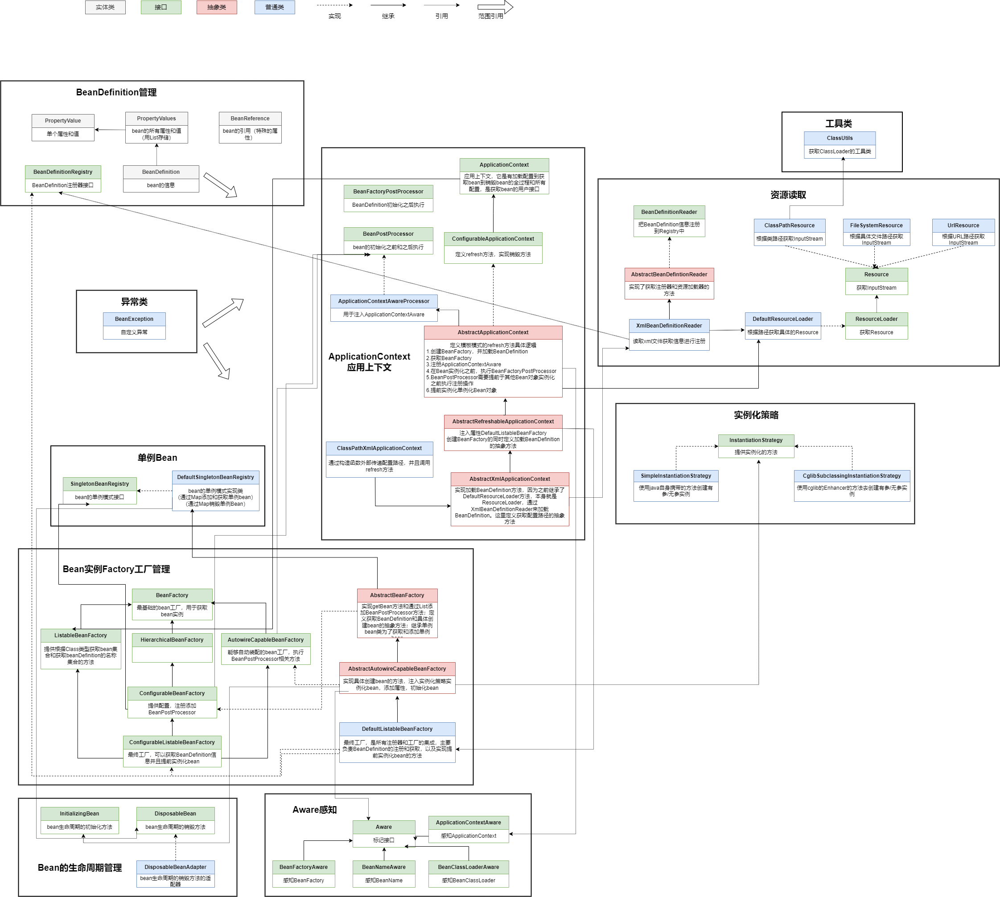

### 第八章：感知容器对象

`学习重点`

通过依赖倒置定义感知容器的标记接口，使Bean对象生命周期中的节点作为接口实现，并在对象实例化后的初始化阶段进行调用，将信息传递给用户。

`学习收获`

1. 目前已实现的Spring框架，在Bean对象方面能提供的功能包括：Bean对象的定义和注册，在Bean对象过程中执行BeanFactoryPostProcessor、BeanPostProcessor、InitializingBean、DisposableBean操作，以及在XML中新增初始化和销毁的配置处理，使得Bean对象具有更强的操作性。

2. 在原有基础上我们想要一种感知容器的接口，能够获取接口入参信息中各类对象提供的功能，并进行一些额外逻辑的处理。

3. 接下来我们正式开始学习本章新增的内容：

   - 定义标记接口：

     定义Aware接口，不需要添加方法，它的存在就像是一种标签，便于统一获取出属于此类接口的实现类

   - 容器感知类：

     继承Aware接口，BeanFactoryAware，定义方法setBeanFactory

     继承Aware接口，BeanClassLoaderAware，定义方法setBeanClassLoader

     继承Aware接口，BeanNameAware，定义方法setBeanName

     继承Aware接口，ApplicationContextAware，定义方法setApplicationContext

   - 包装处理器：

      1. 由于并不能直接在创建Bean时获取ApplicationContext属性，所以需要在执行refresh时，将ApplicationContext写入一个包装的BeanPostProcessor类中，再使用AbstractAutowireCapableBeanFactory.applyBeanPostProcessorsBeforeInitialization方法调用时获取ApplicationContext属性。
      2. 继承BeanPostProcessor接口，ApplicationContextAwareProcessor实现类，注入属性ApplicationContext，外部构造函数传递，实现BeanPostProcessor接口的方法

   - 注册BeanPostProcessor：

     在AbstractApplicationContext中的refresh方法，添加第三步 - 在BeanFactory中添加ApplicationContextAwareProcessor

   - 感知调用：

     在AbstractAutowireCapableBeanFactory的createBean方法中的initializaBean方法添加实现BeanFactoryAware、BeanNameAware、BeanNameAware对应的方法。

     其中BeanClassLoader是在AbstractBeanFactory里面注入属性ClassLoader。

   - 测试：

     在UserService中添加属性ApplicationContext和BeanFactory以及实现四个Aware接口

4. 每一章节内容的实现都是在以设计模式为核心的结构上填充各项模块的功能，单纯的操作编写代码并不会有太多收获，一定是要理解为什么这么设计，这么设计的好处是什么，怎么就那么多接口和抽象类的应用，这些才是 Spring 框架学习的核心所在。

`类图`

