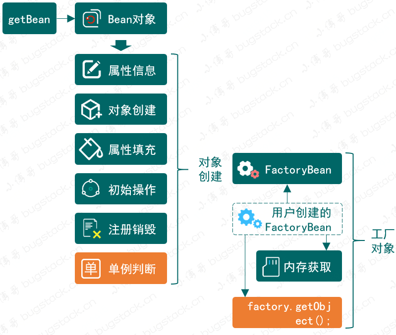
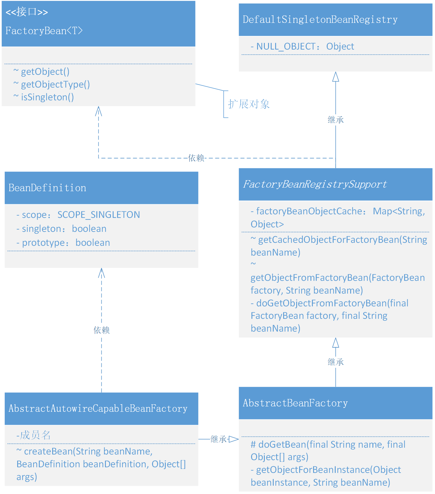
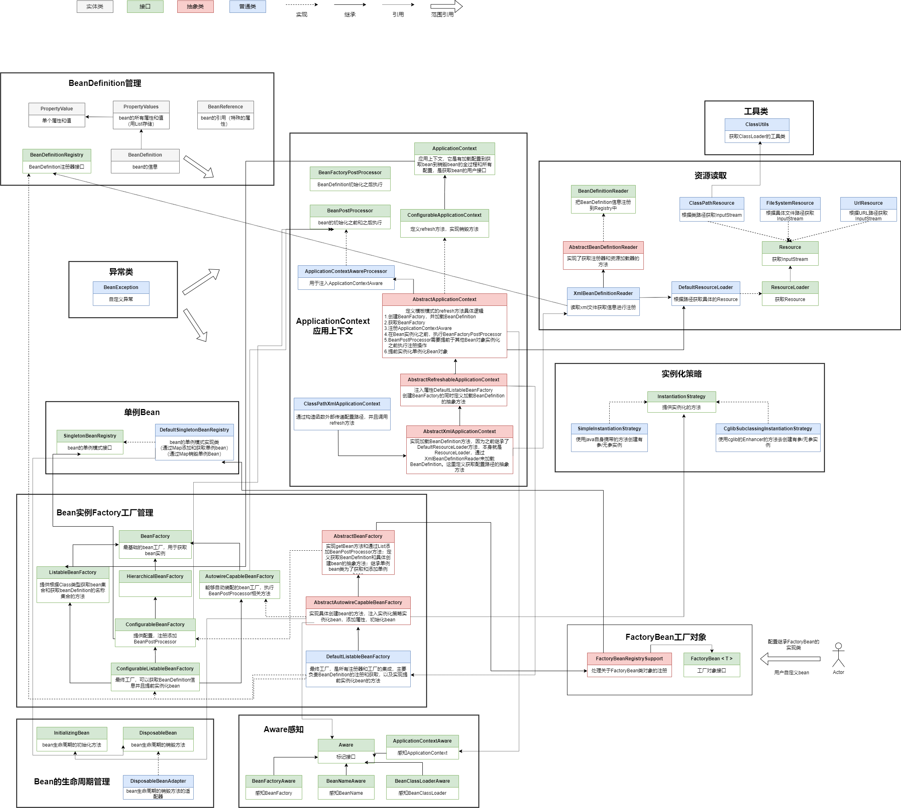

### 第九章：对象作用域和 FactoryBean

`学习重点`

提供 FactoryBean 接口的定义，使用户可以扩展创建复杂的代理 Bean 对象，将 Spring 与其他框架建立容器对象管理。

`学习收获`

1. 对于刚接触 FactoryBean， 我们先谈一下 FactoryBean 和 BeanFactory 的区别——BeanFactory 是 Bean 的工厂，而 FactoryBean 是一个工厂对象。第三方对象生产者提供 FactoryBean的实现类，包装成一个复杂的对象并忽略一些处理细节。

2. 我们本章主要介绍如何实现 FactoryBean 并演示最基本的代理反射思想的调用方法，这也是 ORM 的雏形。考虑如何将复杂且以代理方式动态变化的对象注册到 Spring Bean 容器中。

3. 我们经常说的 CRUD 到底是什么呢🤔，其实它并不是增删改查，而是增查改删。

   哈哈哈哈哈，具体是这样的：Create Read Update Delete。

4. 我们在本章学习的过程中，涉及到单例模式（Singleton）和原型模式（Prototype）的使用。下面介绍一下他它们的区别:

    - 特点
        - 单例模式：类只能有一个实例
        - 原型模式：对象通常是可克隆的
    - 创建时机
        - 单例模式：在类加载时就创建好（饿汉模式）或在第一次请求时创建单例对象（懒汉模式）
        - 原型模式：在每次需要新的对象时都会创建
    - 适用场景
        - 单例模式：更多用于资源管理和控制访问点
        - 原型模式：更多用于减少创建对象的成本

5. 接下来我们把本章的具体代码理解一下：

    - 修改 BeanDefinition：添加 scope （singleton，prototype）属性以及 isSingleton 方法

    - 在 XmlBeanDefinitionReader 的 doLoadBeanDefinitions 方法中添加读取属性 xml 配置文件的 scope 属性并且 set 到 BeanDefinition 中

    - 在 AbstractAutowireCapableBeanFactory 的 createBean 方法的注册单例 bean 方法上添加判断是否为单例对象，在

      registerDisposableBeanIfNecessary 方法中添加前提，判断是否为单例否则不必进行销毁

      这里是因为单例模式的bean生命周期长需要进行销毁来释放资源，而原型模式的bean生命周期短没有必要进行销毁

    - 添加接口 FactoryBean<T>，提供3个方法——获取对象、获取对象类型、判断是否为单例对象

    - 添加抽象类 FactoryBeanRegistrySupport 继承 DefaultSingletonBeanRegistry ，这个类主要处理关于FactoryBean类对象的注册操作。

      注入属性final修饰的map，添加 getCachedObjectForFactoryBean 方法，getObjectFromFactoryBean 方法和内部调用方法doGetObjectFromFactoryBean

      这里的操作和平时我们用redis做缓存是很类似的。

    - 扩展AbstractBeanFactory并创建对象逻辑：

      继承FactoryBeanRegistrySupport，先在doGetBean方法中判断是否不为null，如果是就调用getObjectForBeanInstance方法。

      在getObjectForBeanInstance方法中，我们先判断instanceof FactoryBean，然后再开始从缓存中获取，如果没有则创建。

    - 在测试中我们也做了一些更改

        - 新增接口 IUserDao ，替换原来的UserDao，只保留查询方法
        - 新增 ProxyBeanFactory 实现 FactoryBean，使用代理的方式去创建对象
        - 在spring.xml文件中添加scope属性，并且把原先配置的UserDao更换成ProxyBeanFactory

6. 当你仔细阅读完关于 FactoryBean 的实现以及测试过程的使用，以后再需要使用 FactoryBean 开发相应的组件时候，一定会非常清楚它是如何创建自己的复杂 Bean 对象以及在什么时候初始化和调用的。遇到问题也可以快速的排查、定位和解决。

`类图`

